# Exploratory Data Analysis

- Total number of rows = **9,516,837**

## Columns not important for analysis

- **Id** – Pure row identifier
- **AlertId** – Unique alert identifier
- **AccountSid** – User SID
- **AccountObjectId** – Azure object ID
- **NetworkMessageId** – Message ID
- **OAuthApplicationId** – Identifier only

## Target Columns

- `IncidentGrade`
- `ActionGrouped`
- `ActionGranular`

(All are Object type.)

## Input Columns

```python
[
    'OrgId', 'IncidentId', 'Timestamp', 'DetectorId', 'AlertTitle',
    'Category', 'MitreTechniques', 'EntityType', 'EvidenceRole',
    'Sha256', 'IpAddress', 'Url', 'AccountUpn', 'AccountName',
    'DeviceName', 'EmailClusterId', 'RegistryKey',
    'RegistryValueName', 'RegistryValueData', 'ApplicationName',
    'ThreatFamily', 'FileName', 'FolderPath', 'ResourceType',
    'Roles', 'OSFamily', 'OSVersion', 'AntispamDirection',
    'SuspicionLevel', 'LastVerdict', 'CountryCode',
    'State', 'City', 'DeviceId', 'ApplicationId',
    'ResourceIdName'
]
```

```python
numeric_cols = chunk_dict[0].select_dtypes(include=np.number).columns.tolist()
categorical_cols = chunk_dict[0].select_dtypes(include=object).columns.tolist()
datetime_cols = chunk_dict[0].select_dtypes(
    include=["datetime", "datetimetz"]
).columns.tolist()
```

## Numeric columns

> Initial speculation only. Many (or all) of these may actually be categorical columns stored using label encoding. Each feature will be analyzed separately.

```text
OrgId
IncidentId
DetectorId
AlertTitle
Sha256
IpAddress
Url
AccountUpn
AccountName
DeviceName
EmailClusterId
RegistryKey
RegistryValueName
RegistryValueData
ApplicationName
FileName
FolderPath
OSFamily
OSVersion
CountryCode
State
City
DeviceId
ApplicationId
```

## Categorical columns

```text
Category
MitreTechniques
EntityType
EvidenceRole
ThreatFamily
ResourceType
Roles
AntispamDirection
SuspicionLevel
LastVerdict
IncidentGrade
ActionGrouped
ActionGranular
ResourceIdName
```

## Datetime columns

```text
Timestamp
```

### Note

Columns like `City`, `CountryCode`, etc. are categorical but have high cardinality. One-hot encoding will unnecessarily expand the data.

Also, label encoding (the current representation) may mislead models since these are categorical values and nearby encoded values do not imply similarity.

Hence, instead of relying only on `select_dtypes()`, each feature will be checked individually before deciding whether it is truly numeric.

# Feature-wise EDA

## OrgId

- No need for standardization.
- No missing values.
- Data type is `int64` in every chunk.

```python
for i in range(len(chunk_dict)):
    s = chunk_dict[i]["OrgId"]
    non_numeric = s[~s.apply(lambda x: isinstance(x, (int, float)))]
    print(non_numeric.unique())
```

### Cardinality

- Cardinality is not very high considering the dataset size.
- Number of unique values varies slightly across chunks.
- Taking the union across all chunks gives **5769 unique OrgId values** in the training data.

```python
for i in range(len(chunk_dict)):
    print(chunk_dict[i]["OrgId"].nunique())
```

### Frequency Distribution

```python
freq = (
    pd.concat([chunk_dict[i]['OrgId'] for i in chunk_dict])
    .value_counts(dropna=False)
    .rename('count')
    .reset_index()
)

freq.columns = ['OrgId', 'count']
freq['count_pct'] = (
    (freq['count'] / total_valid_rows) * 100
).round(2).astype(str) + '%'
```

#### Top 20 OrgIds

| OrgId | Count | Count (%) |
|------:|------:|----------:|
| 0 | 844789 | 8.90% |
| 2 | 228325 | 2.41% |
| 1 | 210044 | 2.21% |
| 3 | 190866 | 2.01% |
| 5 | 173431 | 1.83% |
| 6 | 161092 | 1.70% |
| 4 | 145741 | 1.54% |
| 7 | 134532 | 1.42% |
| 8 | 133637 | 1.41% |
| 10 | 133160 | 1.40% |
| 9 | 130807 | 1.38% |
| 11 | 116134 | 1.22% |
| 12 | 114799 | 1.21% |
| 14 | 112681 | 1.19% |
| 13 | 107259 | 1.13% |
| 16 | 87836 | 0.93% |
| 25 | 83539 | 0.88% |
| 17 | 81424 | 0.86% |
| 19 | 80168 | 0.84% |
| 18 | 78881 | 0.83% |

### Observations

- 1845 categories appear fewer than 10 times.
- 1123 categories appear fewer than 5 times.
- Top 25 categories contribute around 40% of the data.
- Top 50 categories contribute more than 50%.
- Total unique categories = **5769**.

| Appearance | Categories |
|-----------:|-----------:|
| 10000+ | 156 |
| 1000-10000 | 600 |
| 100-1000 | 1233 |
| 10-100 | 1935 |
| 5-10 | 722 |
| 3-5 | 911 |
| 1-3 | 212 |

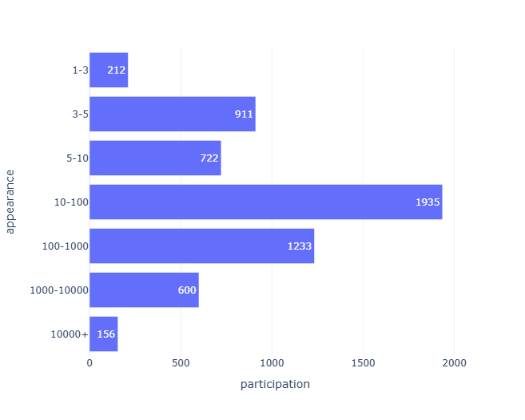

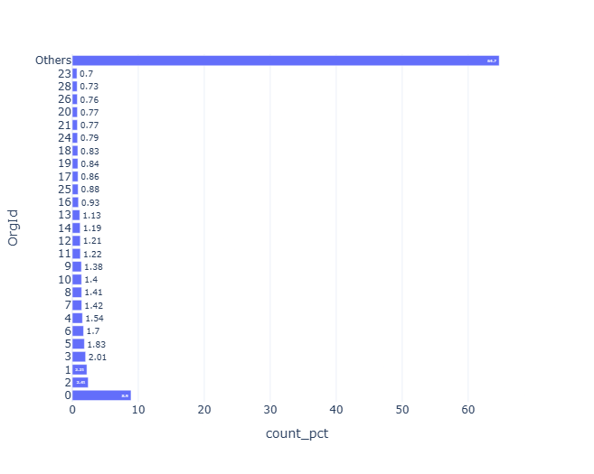

- Nearly 25 Orgs appear on ~40% of the data

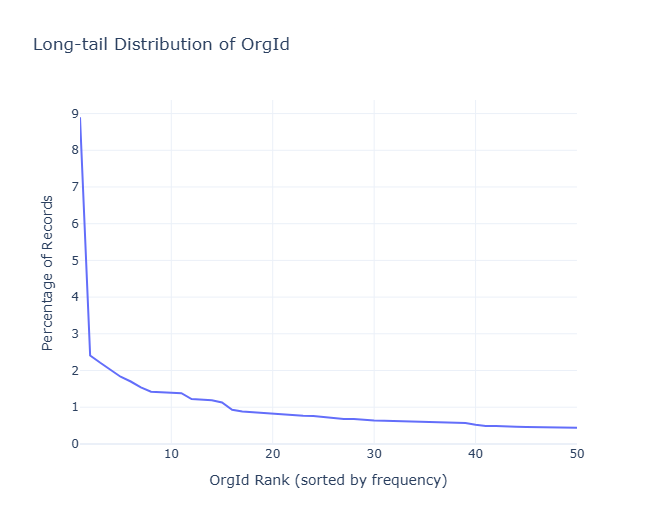

- We can observe how thin the line gets even when we plotted it on top 50 proving the skewness of the data

### Target Distribution

```python
dfs = []

for i in range(len(chunk_dict)):
    df = chunk_dict[i][['OrgId', 'IncidentGrade']].copy()

    category_counts = (
        df.groupby(['OrgId', 'IncidentGrade'])
          .size()
          .unstack(fill_value=0)
    )

    dfs.append(category_counts)

result = (
    pd.concat(dfs)
      .groupby('OrgId')
      .sum()
      .reset_index()
)

result.columns.name = None
result['total_count']=result['FalsePositive']+result['BenignPositive']+result['TruePositive']
result['FalsePositive_pct']=((result['FalsePositive']/result['total_count'])*100).round(3)
result['BenignPositive_pct']=((result['BenignPositive']/result['total_count'])*100).round(3)
result['TruePositive_pct']=((result['TruePositive']/result['total_count'])*100).round(3)
```
#### Conditional Target Distribution (Target | OrgId)
- This analysis examines the conditional distribution of the target variable given the feature (P(Target | OrgId)). It helps identify org whose incident labels are highly skewed toward a particular class, which can indicate that the feature has predictive power.

##### BenignPositive
- Org with more than 10,000 incidents were ranked by their BenignPositive percentage. Several OrgIds exhibit a very high BenignPositive rate, suggesting a strong relationship between OrgId and the target variable.

```python
df=result[['OrgId','total_count','FalsePositive_pct','BenignPositive_pct','TruePositive_pct']][result['total_count']>10000]
BenignPositive_df=df.sort_values('BenignPositive_pct',ascending=False)
BenignPositive_df.head(20)
```
| OrgId | Total Count | FalsePositive (%) | BenignPositive (%) | TruePositive (%) |
|------:|------------:|------------------:|-------------------:|-----------------:|
| 21 | 73,390 | 0.000 | **100.000** | 0.000 |
| 25 | 83,531 | 0.000 | **100.000** | 0.000 |
| 120 | 13,382 | 0.000 | **100.000** | 0.000 |
| 161 | 10,070 | 0.000 | **100.000** | 0.000 |
| 51 | 40,132 | 0.000 | **100.000** | 0.000 |
| 12 | 114,799 | 0.014 | 99.986 | 0.000 |
| 13 | 107,259 | 0.021 | 99.979 | 0.000 |
| 3 | 190,866 | 0.013 | 99.977 | 0.010 |
| 83 | 21,209 | 0.038 | 99.962 | 0.000 |
| 31 | 58,276 | 0.041 | 99.959 | 0.000 |
| 2 | 228,325 | 0.020 | 99.958 | 0.022 |
| 133 | 12,658 | 0.063 | 99.937 | 0.000 |
| 16 | 87,836 | 0.065 | 99.935 | 0.000 |
| 64 | 30,635 | 0.049 | 99.925 | 0.026 |
| 44 | 44,096 | 0.061 | 99.850 | 0.088 |
| 102 | 21,421 | 0.019 | 99.804 | 0.177 |
| 149 | 11,084 | 0.000 | 99.783 | 0.217 |
| 40 | 55,287 | 0.127 | 99.745 | 0.128 |
| 48 | 43,506 | 0.064 | 99.549 | 0.386 |
| 68 | 25,608 | 0.223 | 99.375 | 0.402 |

##### FalsePositive
- Org with more than 10,000 incidents were ranked by their FalsePositive percentage. Several OrgIds exhibit a very high FalsePositive rate, suggesting a strong relationship between OrgId and the target variable.
```python
FalsePositive_df=FalsePositive_df.sort_values('FalsePositive_pct',ascending=False)
FalsePositive_df.head(20)
```

| OrgId | Total Count | FalsePositive (%) | BenignPositive (%) | TruePositive (%) |
|------:|------------:|------------------:|-------------------:|-----------------:|
| 60 | 23,328 | **100.000** | 0.000 | 0.000 |
| 88 | 24,244 | **100.000** | 0.000 | 0.000 |
| 140 | 10,832 | **100.000** | 0.000 | 0.000 |
| 37 | 64,702 | **100.000** | 0.000 | 0.000 |
| 79 | 22,131 | 99.991 | 0.000 | 0.009 |
| 71 | 30,902 | 99.990 | 0.000 | 0.010 |
| 17 | 81,424 | 99.989 | 0.000 | 0.011 |
| 119 | 17,343 | 99.983 | 0.000 | 0.017 |
| 142 | 12,503 | 99.968 | 0.000 | 0.032 |
| 187 | 10,584 | 99.943 | 0.000 | 0.057 |
| 47 | 44,531 | 99.879 | 0.115 | 0.007 |
| 104 | 18,985 | 99.768 | 0.232 | 0.000 |
| 18 | 78,870 | 99.654 | 0.000 | 0.346 |
| 124 | 14,009 | 99.557 | 0.000 | 0.443 |
| 98 | 17,387 | 98.763 | 0.092 | 1.145 |
| 159 | 10,500 | 96.695 | 0.257 | 3.048 |
| 11 | 116,134 | 96.469 | 0.000 | 3.531 |
| 7 | 134,532 | 94.963 | 3.631 | 1.406 |
| 122 | 14,854 | 93.611 | 1.299 | 5.090 |
| 87 | 22,213 | 89.614 | 10.003 | 0.383 |

##### TruePositive
- Org with more than 10,000 incidents were ranked by their TruePositive percentage. Several OrgIds exhibit a very high TruePositive rate, suggesting a strong relationship between OrgId and the target variable.
```python
TruePositive_df=df.sort_values('TruePositive_pct',ascending=False)
TruePositive_df.head(20)
```

| OrgId | Total Count | FalsePositive (%) | BenignPositive (%) | TruePositive (%) |
|------:|------------:|------------------:|-------------------:|-----------------:|
| 22 | 60,418 | 0.000 | 0.000 | **100.000** |
| 72 | 25,866 | 0.000 | 0.000 | **100.000** |
| 110 | 13,545 | 0.000 | 0.000 | **100.000** |
| 63 | 27,288 | 0.000 | 0.000 | **100.000** |
| 76 | 22,631 | 0.000 | 0.000 | **100.000** |
| 0 | 844,782 | 0.005 | 0.000 | 99.995 |
| 117 | 19,701 | 0.020 | 0.000 | 99.980 |
| 35 | 46,807 | 0.043 | 0.000 | 99.957 |
| 148 | 13,856 | 0.058 | 0.000 | 99.942 |
| 89 | 11,262 | 0.098 | 0.000 | 99.902 |
| 1 | 210,035 | 0.103 | 0.000 | 99.897 |
| 90 | 18,579 | 0.151 | 0.000 | 99.849 |
| 169 | 12,921 | 0.217 | 0.000 | 99.783 |
| 10 | 133,160 | 0.000 | 0.271 | 99.729 |
| 41 | 53,993 | 0.267 | 0.035 | 99.698 |
| 75 | 33,901 | 0.342 | 0.000 | 99.658 |
| 178 | 12,188 | 0.361 | 0.000 | 99.639 |
| 8 | 133,629 | 0.058 | 0.542 | 99.400 |
| 5 | 173,409 | 0.607 | 0.000 | 99.393 |
| 101 | 18,463 | 0.628 | 0.000 | 99.372 |

#### Dominant Class Category
```python
target_cols = ['FalsePositive', 'BenignPositive', 'TruePositive']
result['max_target_pct'] = result[target_cols].max(axis=1) / result['total_count'] * 100
result['max_target_pct'].describe()
plt.figure(figsize=(8,5))
plt.hist(result['max_target_pct'], bins=30)
plt.xlabel("Dominant Class Percentage")
plt.ylabel("Number of OrgIds")
plt.title("Distribution of Dominant Target Percentage")
plt.show()
```

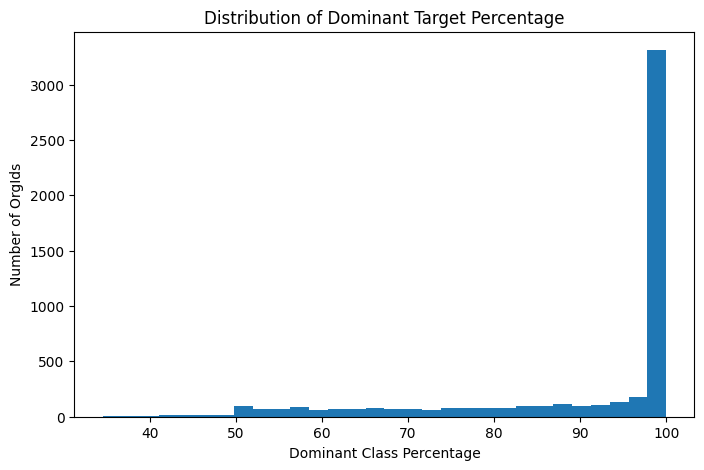

#### Purity Statistics

```python
print("100% Pure :", (result['max_target_pct'] == 100).sum())
print(">99% Pure :", (result['max_target_pct'] >= 99).sum())
print(">95% Pure :", (result['max_target_pct'] >= 95).sum())
print("<80% Pure :", (result['max_target_pct'] < 80).sum())
```

100% Pure : 3047
>99% Pure : 3208
>95% Pure : 3530
<80% Pure : 1103

#### Entrory Distribution

```python
p = result[target_cols].div(result['total_count'], axis=0)
result['entropy'] = -(p * np.log2(p.replace(0, np.nan))).sum(axis=1)
result[['OrgId','entropy']].head()
plt.figure(figsize=(8,5))
plt.hist(result['entropy'], bins=30)
plt.xlabel("Entropy")
plt.ylabel("Number of OrgIds")
plt.title("Entropy Distribution Across OrgIds")
plt.show()
```

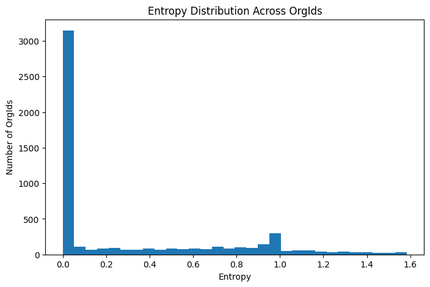

#### Target Distribtution for top 20 Orgs
```python
top = result.nlargest(20,'total_count')

plot_df = top.set_index('OrgId')[
    ['FalsePositive_pct',
     'BenignPositive_pct',
     'TruePositive_pct']
]
plot_df.plot(
    kind='bar',
    stacked=True,
    figsize=(12,5)
)
plt.ylabel("Percentage")
plt.title("Target Distribution for Top 20 OrgIds")
plt.show()
```

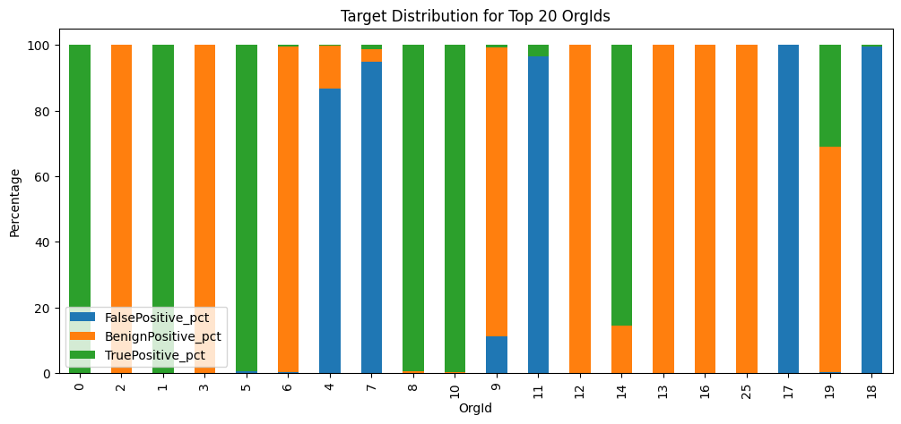

#### Dominant Class Count
```python
result['majority_class'].value_counts().plot.bar()
plt.ylabel("Number of OrgIds")
plt.title("Dominant IncidentGrade per OrgId")
plt.show()
```
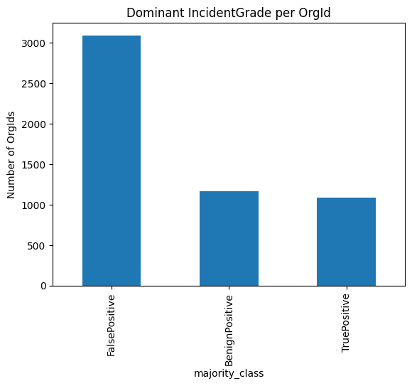

### Relationship with other numeric Cols
```python
corr_list = []

for chunk in chunk_dict.values():
    corr_list.append(chunk[numeric_cols].corr()['OrgId'])

org_corr = pd.concat(corr_list, axis=1).mean(axis=1)
org_corr = org_corr.drop('OrgId').sort_values(key=abs, ascending=False)

print(org_corr)
```
| Feature | Correlation with OrgId |
|:------------------|-----------------------:|
| DetectorId | 0.166254 |
| IpAddress | 0.116416 |
| ApplicationName | -0.056599 |
| ApplicationId | -0.052228 |
| DeviceName | 0.040555 |
| AccountName | -0.038584 |
| City | 0.027538 |
| FolderPath | 0.026376 |
| AccountUpn | -0.026347 |
| IncidentId | 0.025984 |
| CountryCode | 0.025942 |
| EmailClusterId | -0.025336 |
| State | 0.025314 |
| RegistryValueData | -0.015301 |
| FileName | 0.011773 |
| AlertTitle | 0.011576 |
| Url | 0.011563 |
| RegistryValueName | -0.011410 |
| OSVersion | -0.011312 |
| OSFamily | -0.010892 |
| DeviceId | 0.007700 |
| Sha256 | 0.002955 |
| RegistryKey | -0.002926 |

- Observation: OrgId exhibits generally weak linear correlations with the remaining numeric (identifier) features. The highest positive correlation is with DetectorId (0.166), followed by IpAddress (0.116), while all other correlations are close to zero (|r| < 0.06). This suggests that OrgId captures information largely independent of the other encoded identifier features. Since these variables are high-cardinality identifiers rather than true continuous numeric measurements, Pearson correlation should be interpreted only as a descriptive measure and not as evidence of strong feature dependence

## OSVersion

- No need for standardization.
- No missing values.
- Data type is `int64` in every chunk.

```python
for i in range(len(chunk_dict)):
    s = chunk_dict[i]["OSVersion"]
    non_numeric = s[~s.apply(lambda x: isinstance(x, (int, float)))]
    print(non_numeric.unique())
```

### Cardinality

- Cardinality is relatively low also most of the incidents are one category of OSVersion,.
- Number of unique values varies slightly across chunks.
- Taking the union across all chunks gives **58 unique OSVersion values** in the training data.

```python
for i in range(len(chunk_dict)):
    print(chunk_dict[i]["OSVersion"].nunique())
```

### Frequency Distribution

```python
freq = (
    pd.concat([chunk_dict[i]['OSVersion'] for i in chunk_dict])
    .value_counts(dropna=False)
    .rename('count')
    .reset_index()
)

```
- We can clearly see that almost all of OSVersion is '66' with '0' as decent representation anything other than these 2 are almost very low in counts hence count percentage makes not too much sense.
#### Top 50 OSVersion

| - | OSVersion | count |
|---|---:|---:|
| 0 | 66 | 9320086 |
| 1 | 0 | 187316 |
| 2 | 2 | 1892 |
| 3 | 1 | 1651 |
| 4 | 3 | 1125 |
| 5 | 4 | 732 |
| 6 | 6 | 362 |
| 7 | 5 | 266 |
| 8 | 8 | 132 |
| 9 | 9 | 109 |
| 10 | 10 | 89 |
| 11 | 7 | 81 |
| 12 | 11 | 66 |
| 13 | 12 | 54 |
| 14 | 16 | 38 |
| 15 | 13 | 32 |
| 16 | 14 | 31 |
| 17 | 15 | 22 |
| 18 | 19 | 18 |
| 19 | 17 | 17 |
| 20 | 20 | 16 |
| 21 | 22 | 15 |
| 22 | 21 | 14 |
| 23 | 24 | 13 |
| 24 | 26 | 7 |
| 25 | 25 | 7 |
| 26 | 27 | 6 |
| 27 | 31 | 5 |
| 28 | 28 | 5 |
| 29 | 35 | 4 |
| 30 | 33 | 4 |
| 31 | 40 | 3 |
| 32 | 42 | 3 |
| 33 | 29 | 3 |
| 34 | 41 | 3 |
| 35 | 37 | 3 |
| 36 | 38 | 3 |
| 37 | 43 | 2 |
| 38 | 46 | 2 |
| 39 | 30 | 2 |
| 40 | 34 | 2 |
| 41 | 23 | 2 |
| 42 | 44 | 2 |
| 43 | 45 | 2 |
| 44 | 64 | 1 |
| 45 | 53 | 1 |
| 46 | 65 | 1 |
| 47 | 63 | 1 |
| 48 | 52 | 1 |
| 49 | 47 | 1 |

### Observations

- Only 1 category contribute more than 90%.
- Total unique categories = **58**.

| Appearance | Categories |
|-----------:|-----------:|
| 10000+ | 2 |
| 1000-10000 | 3 |
| 100-1000 | 5 |
| 10-100 | 14 |
| 5-10 | 5 |
| 3-5 | 8 |
| 1-3 | 21 |

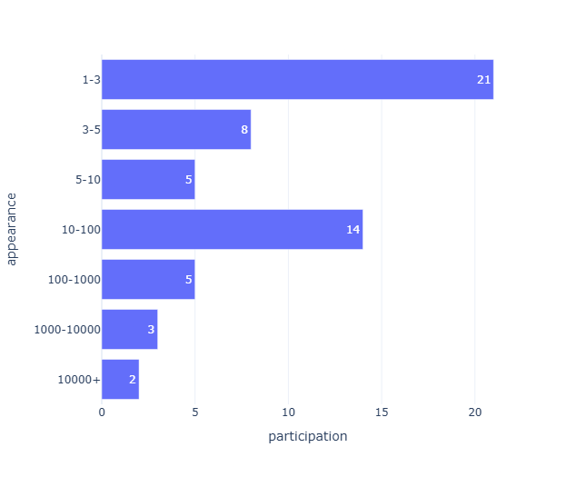

- 1 OSVersion appear on ~90% of the data

| - | OSVersion | count | count_pct | cumsum_count | Rank |
|---|---:|---:|---:|---:|---:|
| 0 | 66 | 9320086 | 97.96 | 97.96 | 1 |
| 1 | 0 | 187316 | 1.97 | 99.93 | 2 |
| 2 | 2 | 1892 | 0.02 | 99.95 | 3 |
| 3 | 1 | 1651 | 0.02 | 99.97 | 4 |
| 4 | 3 | 1125 | 0.01 | 99.98 | 5 |

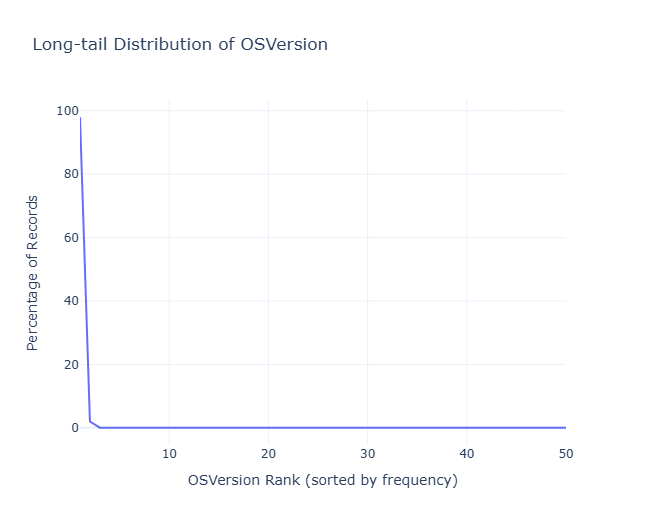

- We can observe how thin the line gets even when we plotted it on top 50 proving the skewness of the data

### Target Distribution

```python
dfs = []

for i in range(len(chunk_dict)):
    df = chunk_dict[i][['OSVersion', 'IncidentGrade']].copy()

    category_counts = (
        df.groupby(['OSVersion', 'IncidentGrade'])
          .size()
          .unstack(fill_value=0)
    )

    dfs.append(category_counts)

result = (
    pd.concat(dfs)
      .groupby('OSVersion')
      .sum()
      .reset_index()
)

result.columns.name = None
result['total_count']=result['FalsePositive']+result['BenignPositive']+result['TruePositive']
result['FalsePositive_pct']=((result['FalsePositive']/result['total_count'])*100).round(3)
result['BenignPositive_pct']=((result['BenignPositive']/result['total_count'])*100).round(3)
result['TruePositive_pct']=((result['TruePositive']/result['total_count'])*100).round(3)
```
#### Conditional Target Distribution (Target | OSVersion)
- This analysis examines the conditional distribution of the target variable given the feature (P(Target | OSVersion)). It helps identify org whose incident labels are highly skewed toward a particular class, which can indicate that the feature has predictive power.

##### BenignPositive
- OSVersion with more than 10,000 incidents were ranked by their BenignPositive percentage. Several OSVersions exhibit a very high BenignPositive rate, suggesting a strong relationship between OSVersion and the target variable.Although Only 2 have more than 10000 appearence.

```python
df=result[['OSVersion','total_count','FalsePositive_pct','BenignPositive_pct','TruePositive_pct']][result['total_count']>10000]
BenignPositive_df=df.sort_values('BenignPositive_pct',ascending=False)
BenignPositive_df.head(20)
```
| - | OSVersion | total_count | FalsePositive_pct | BenignPositive_pct | TruePositive_pct |
|---|---:|---:|---:|---:|---:|
| 0 | 0 | 186004 | 20.497 | 63.937 | 15.566 |
| 57 | 66 | 9270090 | 21.492 | 43.015 | 35.493 |

##### FalsePositive
- OSVersion with more than 10,000 incidents were ranked by their FalsePositive percentage. Several OSVersions exhibit a very high FalsePositive rate, suggesting a strong relationship between OSVersion and the target variable.Although Only 2 have more than 10000 appearence.
```python
FalsePositive_df=FalsePositive_df.sort_values('FalsePositive_pct',ascending=False)
FalsePositive_df.head(20)
```

| - | OSVersion | total_count | FalsePositive_pct | BenignPositive_pct | TruePositive_pct |
|---|---:|---:|---:|---:|---:|
| 57 | 66 | 9270090 | 21.492 | 43.015 | 35.493 |
| 0 | 0 | 186004 | 20.497 | 63.937 | 15.566 |

##### TruePositive
- OSVersion with more than 10,000 incidents were ranked by their TruePositive percentage. Several OSVersions exhibit a very high TruePositive rate, suggesting a strong relationship between OSVersion and the target variable.Although Only 2 have more than 10000 appearence.
```python
TruePositive_df=df.sort_values('TruePositive_pct',ascending=False)
TruePositive_df.head(20)
```

| - | OSVersion | total_count | FalsePositive_pct | BenignPositive_pct | TruePositive_pct |
|---|---:|---:|---:|---:|---:|
| 57 | 66 | 9270090 | 21.492 | 43.015 | 35.493 |
| 0 | 0 | 186004 | 20.497 | 63.937 | 15.566 |

#### Dominant Class Category
```python
target_cols = ['FalsePositive', 'BenignPositive', 'TruePositive']
result['max_target_pct'] = result[target_cols].max(axis=1) / result['total_count'] * 100
result['max_target_pct'].describe()
plt.figure(figsize=(8,5))
plt.hist(result['max_target_pct'], bins=30)
plt.xlabel("Dominant Class Percentage")
plt.ylabel("Number of OSVersions")
plt.title("Distribution of Dominant Target Percentage")
plt.show()
```

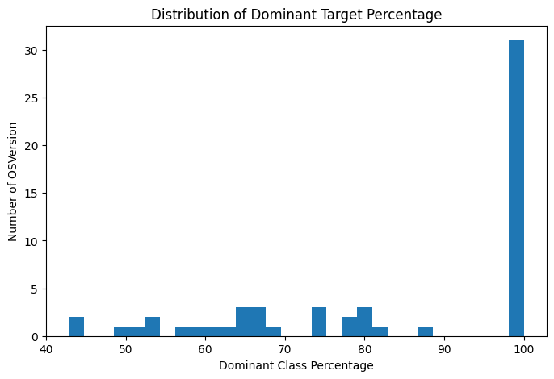

#### Purity Statistics
```python

print("100% Pure :", (result['max_target_pct'] == 100).sum())
print(">99% Pure :", (result['max_target_pct'] >= 99).sum())
print(">95% Pure :", (result['max_target_pct'] >= 95).sum())
print("<80% Pure :", (result['max_target_pct'] < 80).sum())
```

100% Pure : 31
>99% Pure : 31
>95% Pure : 31
<80% Pure : 22

#### Entrory Distribution

```python
p = result[target_cols].div(result['total_count'], axis=0)
result['entropy'] = -(p * np.log2(p.replace(0, np.nan))).sum(axis=1)
result[['OSVersion','entropy']].head()
plt.figure(figsize=(8,5))
plt.hist(result['entropy'], bins=30)
plt.xlabel("Entropy")
plt.ylabel("Number of OSVersions")
plt.title("Entropy Distribution Across OrgIds")
plt.show()
```

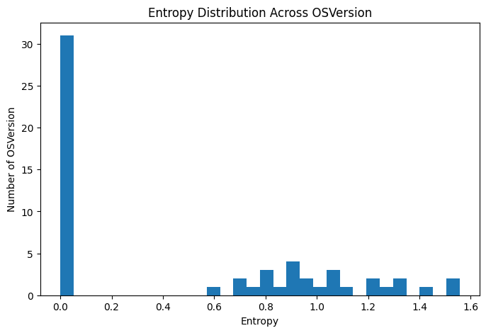

#### Target Distribtution for top 20 OSVersions
```python
top = result.nlargest(20,'total_count')

plot_df = top.set_index('OSVersion')[
    ['FalsePositive_pct',
     'BenignPositive_pct',
     'TruePositive_pct']
]
plot_df.plot(
    kind='bar',
    stacked=True,
    figsize=(12,5)
)
plt.ylabel("Percentage")
plt.title("Target Distribution for Top 20 OSVersions")
plt.show()
```

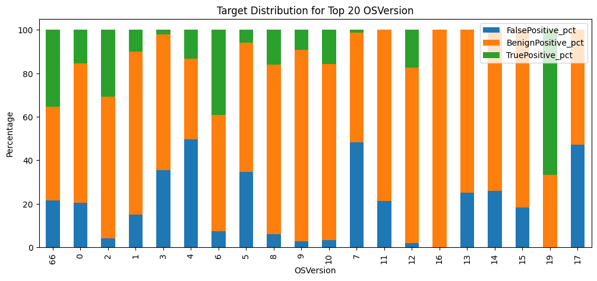

#### Dominant Class Count
```python
result['majority_class'].value_counts().plot.bar()
plt.ylabel("Number of OSVersions")
plt.title("Dominant IncidentGrade per OSVersion")
plt.show()
```
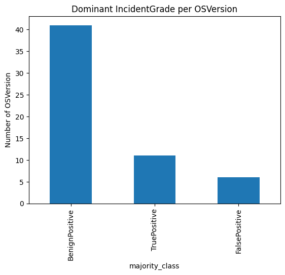

### Relationship with other numeric Cols
```python
corr_list = []

for chunk in chunk_dict.values():
    corr_list.append(chunk[numeric_cols].corr()['OSVersion'])

os_corr = pd.concat(corr_list, axis=1).mean(axis=1)
os_corr = os_corr.drop('OSVersion').sort_values(key=abs, ascending=False)

print(os_corr)
```
| Feature | Correlation with OSVersion |
|---|---:|
| OSFamily | 0.999292 |
| DeviceId | 0.685686 |
| DeviceName | 0.470725 |
| AccountUpn | -0.104210 |
| AccountName | -0.079692 |
| IpAddress | -0.076495 |
| FileName | -0.048350 |
| FolderPath | -0.045041 |
| IncidentId | -0.043929 |
| CountryCode | -0.042103 |
| Sha256 | -0.040546 |
| Url | -0.038731 |
| State | -0.038437 |
| City | -0.038397 |
| ApplicationName | -0.022121 |
| ApplicationId | -0.021807 |
| AlertTitle | 0.011792 |
| OrgId | -0.011312 |
| RegistryKey | -0.006119 |
| DetectorId | -0.004613 |
| RegistryValueData | -0.003365 |
| RegistryValueName | -0.003045 |
| EmailClusterId | NaN |

- Observation: OSVersion exhibits a very strong positive linear correlation with OSFamily (0.999), followed by DeviceId (0.686) and DeviceName (0.471). The remaining features show relatively weak correlations, with the strongest negative relationship observed for AccountUpn (-0.104), while most other correlations are close to zero (|r| < 0.08). This suggests that OSVersion is highly aligned with OSFamily and has some association with device-related identifiers, while capturing information largely independent of the remaining encoded features. Since these variables are predominantly high-cardinality identifiers or categorical features encoded numerically rather than true continuous measurements, Pearson correlation should be interpreted only as a descriptive measure and not as evidence of meaningful causal or feature dependence.

## DetectorId

- No need for standardization.
- No missing values.
- Data type is `int64` in every chunk.

```python
for i in range(len(chunk_dict)):
    s = chunk_dict[i]["DetectorId"]
    non_numeric = s[~s.apply(lambda x: isinstance(x, (int, float)))]
    print(non_numeric.unique())
```

### Cardinality

- Cardinality quite high considering the dataset size.
- Number of unique values varies slightly across chunks.
- Taking the union across all chunks gives **8428 unique DetectorId values** in the training data.

```python
for i in range(len(chunk_dict)):
    print(chunk_dict[i]["DetectorId"].nunique())
```

### Frequency Distribution

```python
freq = (
    pd.concat([chunk_dict[i]['DetectorId'] for i in chunk_dict])
    .value_counts(dropna=False)
    .rename('count')
    .reset_index()
)
freq=freq.sort_values('count',ascending=False)
freq['count_pct(%)']=((freq['count']/9516837)*100).round(3)
freq['cumsum_pct']=freq['count_pct(%)'].cumsum()
freq.columns = ['DetectorId', 'count','count_pct(%)','cumsum_pct']
```

#### Top 50 DetectorIds

| DetectorId | count | count_pct(%) | cumsum_pct |
|-----------:|------:|-------------:|-----------:|
| 0  | 1330918 | 13.985 | 13.985 |
| 1  | 774535  | 8.139 | 22.124 |
| 2  | 597497  | 6.278 | 28.402 |
| 3  | 491016  | 5.159 | 33.561 |
| 4  | 412083  | 4.330 | 37.891 |
| 5  | 341823  | 3.592 | 41.483 |
| 6  | 334651  | 3.516 | 44.999 |
| 7  | 308370  | 3.240 | 48.239 |
| 9  | 154113  | 1.619 | 49.858 |
| 8  | 145547  | 1.529 | 51.387 |
| 10 | 135410  | 1.423 | 52.810 |
| 12 | 130925  | 1.376 | 54.186 |
| 11 | 117799  | 1.238 | 55.424 |
| 15 | 96978   | 1.019 | 56.443 |
| 17 | 94545   | 0.993 | 57.436 |
| 16 | 93610   | 0.984 | 58.420 |
| 13 | 93241   | 0.980 | 59.400 |
| 18 | 90809   | 0.954 | 60.354 |
| 14 | 88411   | 0.929 | 61.283 |
| 19 | 77459   | 0.814 | 62.097 |
| 20 | 76300   | 0.802 | 62.899 |
| 21 | 73760   | 0.775 | 63.674 |
| 30 | 62978   | 0.662 | 64.336 |
| 23 | 62491   | 0.657 | 64.993 |
| 24 | 62187   | 0.653 | 65.646 |
| 22 | 60006   | 0.631 | 66.277 |
| 25 | 59948   | 0.630 | 66.907 |
| 28 | 57595   | 0.605 | 67.512 |
| 29 | 54248   | 0.570 | 68.082 |
| 31 | 53103   | 0.558 | 68.640 |
| 32 | 53062   | 0.558 | 69.198 |
| 27 | 49927   | 0.525 | 69.723 |
| 33 | 49080   | 0.516 | 70.239 |
| 34 | 48669   | 0.511 | 70.750 |
| 41 | 46422   | 0.488 | 71.238 |
| 37 | 43456   | 0.457 | 71.695 |
| 36 | 43110   | 0.453 | 72.148 |
| 35 | 40640   | 0.427 | 72.575 |
| 38 | 39279   | 0.413 | 72.988 |
| 39 | 37869   | 0.398 | 73.386 |
| 42 | 36732   | 0.386 | 73.772 |
| 44 | 33491   | 0.352 | 74.124 |
| 46 | 33171   | 0.349 | 74.473 |
| 40 | 32895   | 0.346 | 74.819 |
| 47 | 31709   | 0.333 | 75.152 |
| 45 | 30907   | 0.325 | 75.477 |
| 43 | 26546   | 0.279 | 75.756 |
| 50 | 26292   | 0.276 | 76.032 |
| 49 | 25338   | 0.266 | 76.298 |
| 52 | 24002   | 0.252 | 76.550 |

### Observations

- 3723 categories appear fewer than 10 times.
- 2448 categories appear fewer than 5 times.
- Top 5 categories contribute around 40% of the data.
- Top 50 categories contribute more than 75%.
- Total unique categories = **8428**.

| Appearance | Categories |
|-----------:|-----------:|
| 10000+ | 100 |
| 1000-10000 | 345 |
| 100-1000 | 1160 |
| 10-100 | 3162 |
| 5-10 | 1275 |
| 3-5 | 1173 |
| 1-3 | 1213 |

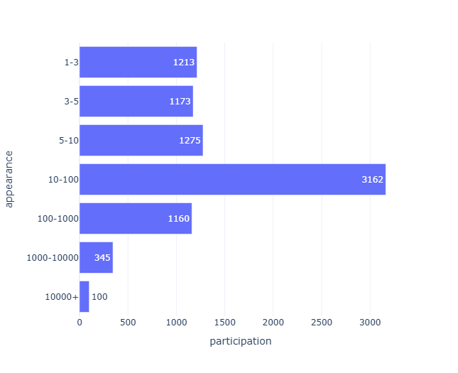

- Nearly 5 DetectorIds appear on ~40% of the data

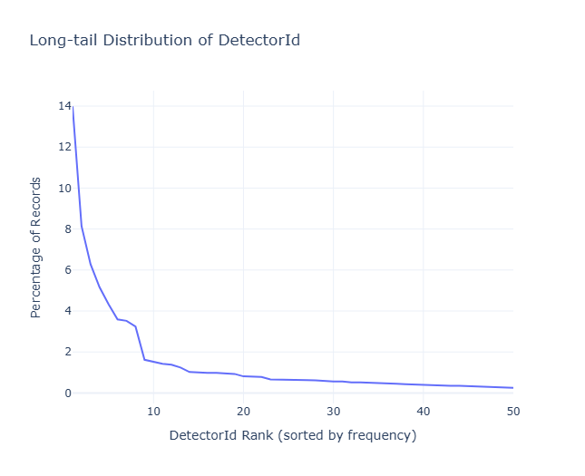

- We can observe how thin the line gets even when we plotted it on top 50 proving the skewness of the data (Although 6,7,8 ids are almost similar putting a bump in trend)

### Target Distribution

```python
dfs = []

for i in range(len(chunk_dict)):
    df = chunk_dict[i][['DetectorId', 'IncidentGrade']].copy()

    category_counts = (
        df.groupby(['DetectorId', 'IncidentGrade'])
          .size()
          .unstack(fill_value=0)
    )

    dfs.append(category_counts)

result = (
    pd.concat(dfs)
      .groupby('DetectorId')
      .sum()
      .reset_index()
)

result.columns.name = None
result['total_count']=result['FalsePositive']+result['BenignPositive']+result['TruePositive']
result['FalsePositive_pct']=((result['FalsePositive']/result['total_count'])*100).round(3)
result['BenignPositive_pct']=((result['BenignPositive']/result['total_count'])*100).round(3)
result['TruePositive_pct']=((result['TruePositive']/result['total_count'])*100).round(3)
```
#### Conditional Target Distribution (Target | DetectorId)
- This analysis examines the conditional distribution of the target variable given the feature (P(Target | DetectorId)). It helps identify DetectorId whose incident labels are highly skewed toward a particular class, which can indicate that the feature has predictive power.

##### BenignPositive
- DetectorId with more than 10,000 incidents were ranked by their BenignPositive percentage. Several DetectorIds exhibit a very high BenignPositive rate, suggesting a strong relationship between DetectorId and the target variable.

```python
df=result[['DetectorId','total_count','FalsePositive_pct','BenignPositive_pct','TruePositive_pct']][result['total_count']>10000]
BenignPositive_df=df.sort_values(by=['BenignPositive_pct','total_count'],ascending=[False,False])
BenignPositive_df.head(20)
```
| DetectorId | total_count | FalsePositive_pct | BenignPositive_pct | TruePositive_pct |
|-----------:|------------:|------------------:|-------------------:|-----------------:|
| 15 | 96978  | 0.000 | **100.00** | 0.000 |
| 16 | 93610  | 0.000 | **100.00** | 0.000 |
| 18 | 90809  | 0.000 | **100.00** | 0.000 |
| 30 | 62972  | 0.000 | **100.00** | 0.000 |
| 24 | 62187  | 0.000 | **100.00** | 0.000 |
| 34 | 48669  | 0.000 | **100.00** | 0.000 |
| 38 | 39279  | 0.000 | **100.00** | 0.000 |
| 39 | 37869  | 0.000 | **100.00** | 0.000 |
| 42 | 36732  | 0.000 | **100.00** | 0.000 |
| 46 | 33171  | 0.000 | **100.00** | 0.000 |
| 45 | 30903  | 0.000 | **100.00** | 0.000 |
| 50 | 26292  | 0.000 | **100.00** | 0.000 |
| 55 | 22676  | 0.000 | **100.00** | 0.000 |
| 54 | 20860  | 0.000 | **100.00** | 0.000 |
| 67 | 20816  | 0.000 | **100.00** | 0.000 |
| 60 | 19768  | 0.000 | **100.00** | 0.000 |
| 74 | 19526  | 0.000 | **100.00** | 0.000 |
| 77 | 17829  | 0.000 | **100.00** | 0.000 |
| 65 | 17512  | 0.000 | **100.00** | 0.000 |
| 72 | 15981  | 0.000 | **100.00** | 0.000 |

##### FalsePositive
- DetectorId with more than 10,000 incidents were ranked by their FalsePositive percentage. Several DetectorIds exhibit a very high FalsePositive rate, suggesting a strong relationship between DetectorId and the target variable.
```python
FalsePositive_df=df.sort_values(by=['FalsePositive_pct','total_count'],ascending=[False,False])
FalsePositive_df.head(20)
```

| DetectorId | total_count | FalsePositive_pct | BenignPositive_pct | TruePositive_pct |
|-----------:|------------:|------------------:|-------------------:|-----------------:|
| 20 | 76300 | **100.00** | 0.000 | 0.000 |
| 58 | 23964 | **100.00** | 0.000 | 0.000 |
| 57 | 22019 | **100.00** | 0.000 | 0.000 |
| 51 | 19590 | **100.00** | 0.000 | 0.000 |
| 61 | 19519 | **100.00** | 0.000 | 0.000 |
| 70 | 18923 | **100.00** | 0.000 | 0.000 |
| 71 | 16359 | **100.00** | 0.000 | 0.000 |
| 76 | 15050 | **100.00** | 0.000 | 0.000 |
| 80 | 14248 | **100.00** | 0.000 | 0.000 |
| 97 | 12974 | **100.00** | 0.000 | 0.000 |
| 98 | 12461 | **100.00** | 0.000 | 0.000 |
| 103 | 12389 | **100.00** | 0.000 | 0.000 |
| 105 | 11490 | **100.00** | 0.000 | 0.000 |
| 56 | 22170 | 99.558 | 0.442 | 0.000 |
| 21 | 73760 | 95.883 | 4.117 | 0.000 |
| 22 | 60006 | 93.781 | 3.075 | 3.145 |
| 8 | 145547 | 86.883 | 13.117 | 0.000 |
| 91 | 10983 | 81.499 | 11.035 | 7.466 |
| 37 | 43456 | 77.338 | 22.662 | 0.000 |
| 49 | 25338 | 61.856 | 38.144 | 0.000 |

##### TruePositive
- DetectorId with more than 10,000 incidents were ranked by their TruePositive percentage. Several DetectorIds exhibit a very high TruePositive rate, suggesting a strong relationship between DetectorId and the target variable.
```python
TruePositive_df=df.sort_values(by=['TruePositive_pct','total_count'],ascending=[False,False])
TruePositive_df.head(20)
```
| DetectorId | total_count | FalsePositive_pct | BenignPositive_pct | TruePositive_pct |
|-----------:|------------:|------------------:|-------------------:|-----------------:|
| 12 | 130925 | 0.000 | 0.000 | **100.00** |
| 29 | 54248  | 0.000 | 0.000 | **100.00** |
| 32 | 53004  | 0.000 | 0.000 | **100.00** |
| 68 | 19113  | 0.000 | 0.000 | **100.00** |
| 82 | 13738  | 0.000 | 0.102 | 99.898 |
| 7 | 308267 | 1.540 | 1.640 | 96.821 |
| 14 | 88403  | 3.509 | 1.752 | 94.739 |
| 4 | 411779  | 10.907 | 1.647 | 87.447 |
| 41 | 46422  | 0.000 | 23.948 | 76.052 |
| 0 | 1330286 | 22.622 | 1.994 | 75.384 |
| 66 | 16183  | 17.432 | 32.893 | 49.676 |
| 19 | 77400  | 51.611 | 1.643 | 46.745 |
| 5 | 333906  | 17.832 | 37.287 | 44.881 |
| 47 | 31146  | 29.275 | 33.574 | 37.151 |
| 23 | 62491  | 0.000 | 63.716 | 36.284 |
| 1 | 774535  | 15.218 | 49.011 | 35.771 |
| 44 | 33429  | 15.564 | 50.289 | 34.147 |
| 3 | 490324  | 6.126 | 59.915 | 33.959 |
| 35 | 39464  | 22.542 | 48.279 | 29.178 |
| 10 | 135410 | 5.321 | 66.327 | 28.352 |

#### Dominant Class Category
```python
target_cols = ['FalsePositive', 'BenignPositive', 'TruePositive']
result['max_target_pct'] = result[target_cols].max(axis=1) / result['total_count'] * 100
result['max_target_pct'].describe()
plt.figure(figsize=(8,5))
plt.hist(result['max_target_pct'], bins=30)
plt.xlabel("Dominant Class Percentage")
plt.ylabel("Number of DetectorIds")
plt.title("Distribution of Dominant Target Percentage")
plt.show()
```

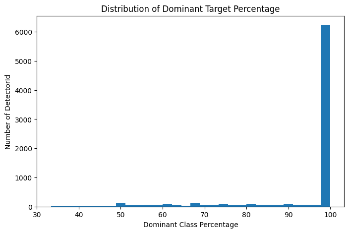

#### Purity Statistics
```python
print("100% Pure :", (result['max_target_pct'] == 100).sum())
print(">99% Pure :", (result['max_target_pct'] >= 99).sum())
print(">95% Pure :", (result['max_target_pct'] >= 95).sum())
print("<80% Pure :", (result['max_target_pct'] < 80).sum())
```
100% Pure : 6163
>99% Pure : 6201
>95% Pure : 6325
<80% Pure : 1007

#### Entrory Distribution

```python
p = result[target_cols].div(result['total_count'], axis=0)
result['entropy'] = -(p * np.log2(p.replace(0, np.nan))).sum(axis=1)
result[['DetectorId','entropy']].head()
plt.figure(figsize=(8,5))
plt.hist(result['entropy'], bins=30)
plt.xlabel("Entropy")
plt.ylabel("Number of DetectorIds")
plt.title("Entropy Distribution Across DetectorIds")
plt.show()
```

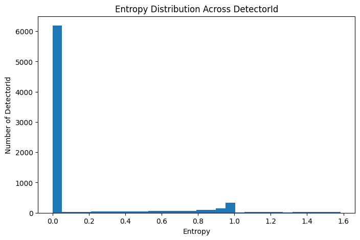

#### Target Distribtution for top 20 DetectorIds
```python
top = result.nlargest(20,'total_count')

plot_df = top.set_index('DetectorId')[
    ['FalsePositive_pct',
     'BenignPositive_pct',
     'TruePositive_pct']
]
plot_df.plot(
    kind='bar',
    stacked=True,
    figsize=(12,5)
)
plt.ylabel("Percentage")
plt.title("Target Distribution for Top 20 DetectorIds")
plt.show()
```

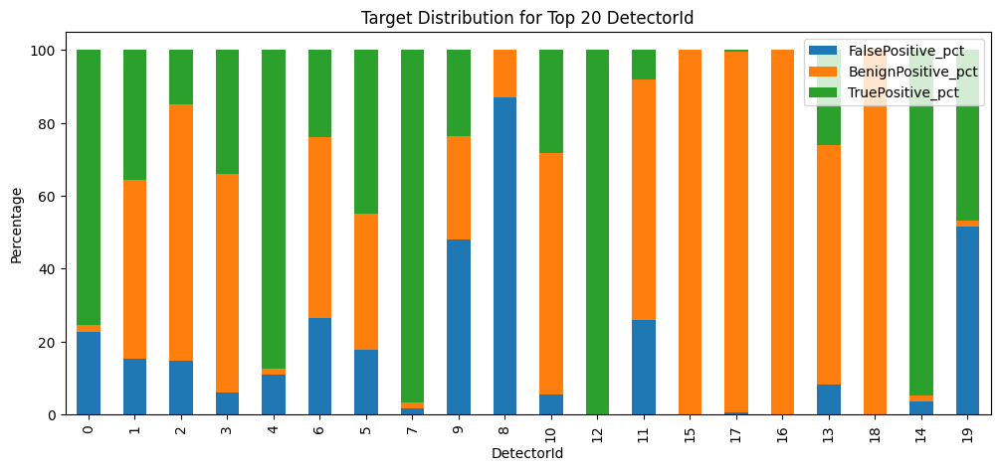

#### Dominant Class Count
```python
result['majority_class'].value_counts().plot.bar()
plt.ylabel("Number of DetectorIds")
plt.title("Dominant IncidentGrade per DetectorId")
plt.show()
```
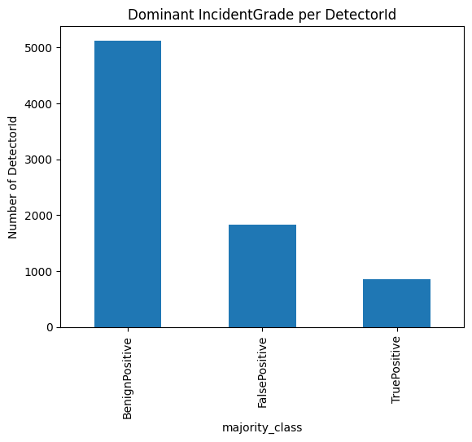

### Relationship with other numeric Cols
```python
corr_list = []

for chunk in chunk_dict.values():
    corr_list.append(chunk[numeric_cols].corr()['DetectorId'])

DetectorId_corr = pd.concat(corr_list, axis=1).mean(axis=1)
DetectorId_corr = DetectorId_corr.drop('DetectorId').sort_values(key=abs, ascending=False)

print(DetectorId_corr)
```
| Feature | Correlation |
|---|---:|
| AlertTitle | 0.266036 |
| OrgId | 0.166254 |
| CountryCode | 0.069545 |
| State | 0.063594 |
| City | 0.063315 |
| IncidentId | 0.059369 |
| FolderPath | -0.056850 |
| RegistryValueName | -0.047086 |
| RegistryValueData | -0.044645 |
| IpAddress | 0.043654 |
| Url | 0.040912 |
| FileName | -0.040087 |
| DeviceName | -0.032363 |
| DeviceId | -0.029408 |
| Sha256 | -0.021057 |
| EmailClusterId | -0.020634 |
| ApplicationId | 0.018115 |
| RegistryKey | -0.015672 |
| AccountName | -0.015046 |
| AccountUpn | 0.014795 |
| ApplicationName | 0.009293 |
| OSVersion | -0.004613 |
| OSFamily | -0.004290 |

- Observation: The features show generally weak linear correlations with the DetectorId. AlertTitle (0.266) has the strongest positive correlation, followed by OrgId (0.166), while all others remain below |r| < 0.07. Overall, the features appear largely independent in terms of linear relationships. Since most are high-cardinality identifiers or categorical variables, Pearson correlation should be treated as a descriptive measure only.

## AlertTitle

- No need for standardization.
- No missing values.
- Data type is `int64` in every chunk.

```python
for i in range(len(chunk_dict)):
    s = chunk_dict[i]["AlertTitle"]
    non_numeric = s[~s.apply(lambda x: isinstance(x, (int, float)))]
    print(non_numeric.unique())
```

### Cardinality

- Cardinality is very high considering the dataset size.
- Number of unique values varies highly (almost 30000 categories in difference) across chunks.
- Taking the union across all chunks gives **86149 unique AlertTitle values** in the training data.

```python
for i in range(len(chunk_dict)):
    print(chunk_dict[i]["AlertTitle"].nunique())
```

### Frequency Distribution

```python
freq = (
    pd.concat([chunk_dict[i]['AlertTitle'] for i in chunk_dict])
    .value_counts(dropna=False)
    .rename('count')
    .reset_index()
)
freq=freq.sort_values('count',ascending=False)
freq['count_pct(%)']=((freq['count']/9516837)*100).round(3)
freq['cumsum_pct']=freq['count_pct(%)'].cumsum()
freq.columns = ['AlertTitle', 'count','count_pct(%)','cumsum_pct']
```

#### Top 50 AlertTitles

| AlertTitle | count | count_pct(%) | cumsum_pct |
|-----------:|------:|-------------:|-----------:|
| 0  | 1330918 | 13.985 | 13.985 |
| 1  | 774535  | 8.139 | 22.124 |
| 2  | 597497  | 6.278 | 28.402 |
| 4  | 413879  | 4.349 | 32.751 |
| 3  | 412083  | 4.330 | 37.081 |
| 5  | 334651  | 3.516 | 40.597 |
| 6  | 308370  | 3.240 | 43.837 |
| 7  | 145547  | 1.529 | 45.366 |
| 8  | 135410  | 1.423 | 46.789 |
| 9  | 117799  | 1.238 | 48.027 |
| 10 | 105390  | 1.107 | 49.134 |
| 13 | 97108   | 1.020 | 50.154 |
| 11 | 93241   | 0.980 | 51.134 |
| 14 | 91071   | 0.957 | 52.091 |
| 12 | 88411   | 0.929 | 53.020 |
| 15 | 77459   | 0.814 | 53.834 |
| 16 | 62491   | 0.657 | 54.491 |
| 17 | 59948   | 0.630 | 55.121 |
| 19 | 57595   | 0.605 | 55.726 |
| 20 | 54248   | 0.570 | 56.296 |
| 21 | 50889   | 0.535 | 56.831 |
| 18 | 49927   | 0.525 | 57.356 |
| 22 | 49080   | 0.516 | 57.872 |
| 24 | 44634   | 0.469 | 58.341 |
| 23 | 40640   | 0.427 | 58.768 |
| 25 | 40543   | 0.426 | 59.194 |
| 26 | 37869   | 0.398 | 59.592 |
| 27 | 36732   | 0.386 | 59.978 |
| 29 | 34180   | 0.359 | 60.337 |
| 30 | 31709   | 0.333 | 60.670 |
| 32 | 29230   | 0.307 | 60.977 |
| 31 | 28263   | 0.297 | 61.274 |
| 34 | 28134   | 0.296 | 61.570 |
| 33 | 27591   | 0.290 | 61.860 |
| 28 | 26546   | 0.279 | 62.139 |
| 36 | 26292   | 0.276 | 62.415 |
| 39 | 25755   | 0.271 | 62.686 |
| 37 | 25684   | 0.270 | 62.956 |
| 35 | 25338   | 0.266 | 63.222 |
| 38 | 24850   | 0.261 | 63.483 |
| 42 | 24654   | 0.259 | 63.742 |
| 43 | 23964   | 0.252 | 63.994 |
| 40 | 22170   | 0.233 | 64.227 |
| 52 | 19658   | 0.207 | 64.434 |
| 55 | 19526   | 0.205 | 64.639 |
| 44 | 19519   | 0.205 | 64.844 |
| 45 | 19018   | 0.200 | 65.044 |
| 41 | 18613   | 0.196 | 65.240 |
| 47 | 17962   | 0.189 | 65.429 |
| 46 | 17958   | 0.189 | 65.618 |

### Observations

- 55290 categories appear fewer than 10 times.
- 34394 categories appear fewer than 5 times.
- Top 10 categories contribute around 50% of the data.
- Top 50 categories contribute more than 65%.
- Total unique categories = **86149**.

| Appearance | Categories |
|-----------:|-----------:|
| 10000+ | 76 |
| 1000-10000 | 452 |
| 100-1000 | 2985 |
| 10-100 | 27346 |
| 5-10 | 20896 |
| 3-5 | 22470 |
| 1-3 | 11924 |

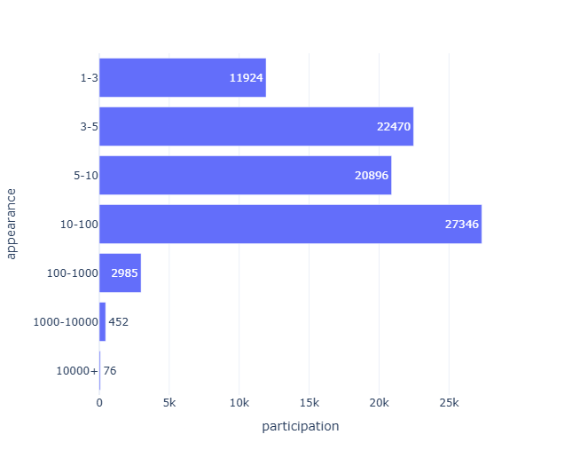

- Nearly 10 AlertTitles appear on ~50% of the data

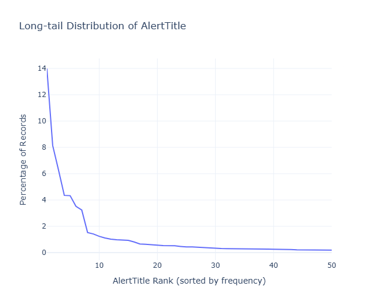

- We can observe how thin the line gets even when we plotted it on top 50 proving the skewness of the data

### Target Distribution

```python
dfs = []

for i in range(len(chunk_dict)):
    df = chunk_dict[i][['AlertTitle', 'IncidentGrade']].copy()

    category_counts = (
        df.groupby(['AlertTitle', 'IncidentGrade'])
          .size()
          .unstack(fill_value=0)
    )

    dfs.append(category_counts)

result = (
    pd.concat(dfs)
      .groupby('AlertTitle')
      .sum()
      .reset_index()
)

result.columns.name = None
result['total_count']=result['FalsePositive']+result['BenignPositive']+result['TruePositive']
result['FalsePositive_pct']=((result['FalsePositive']/result['total_count'])*100).round(3)
result['BenignPositive_pct']=((result['BenignPositive']/result['total_count'])*100).round(3)
result['TruePositive_pct']=((result['TruePositive']/result['total_count'])*100).round(3)
```
#### Conditional Target Distribution (Target | AlertTitle)
- This analysis examines the conditional distribution of the target variable given the feature (P(Target | AlertTitle)). It helps identify AlertTitle whose incident labels are highly skewed toward a particular class, which can indicate that the feature has predictive power.

##### BenignPositive
- AlertTitle with more than 10,000 incidents were ranked by their BenignPositive percentage. Several AlertTitles exhibit a very high BenignPositive rate, suggesting a strong relationship between AlertTitle and the target variable.

```python
df=result[['AlertTitle','total_count','FalsePositive_pct','BenignPositive_pct','TruePositive_pct']][result['total_count']>10000]
BenignPositive_df=df.sort_values(by=['BenignPositive_pct','total_count'],ascending=[False,False])
BenignPositive_df.head(20)
```
| AlertTitle | total_count | FalsePositive_pct | BenignPositive_pct | TruePositive_pct |
|-----------:|------------:|------------------:|-------------------:|-----------------:|
| 13 | 96978 | 0.000 | **100.00** | 0.000 |
| 26 | 37869 | 0.000 | **100.00** | 0.000 |
| 27 | 36732 | 0.000 | **100.00** | 0.000 |
| 36 | 26292 | 0.000 | **100.00** | 0.000 |
| 37 | 25684 | 0.000 | **100.00** | 0.000 |
| 55 | 19526 | 0.000 | **100.00** | 0.000 |
| 53 | 15981 | 0.000 | **100.00** | 0.000 |
| 61 | 14346 | 0.000 | **100.00** | 0.000 |
| 73 | 11318 | 0.000 | **100.00** | 0.000 |
| 75 | 10537 | 0.000 | **100.00** | 0.000 |
| 78 | 10511 | 0.000 | **100.00** | 0.000 |
| 45 | 19018 | 0.000 | 99.968 | 0.032 |
| 57 | 14297 | 0.077 | 99.923 | 0.000 |
| 14 | 90977 | 0.185 | 99.815 | 0.000 |
| 25 | 40543 | 0.118 | 99.714 | 0.168 |
| 72 | 11156 | 0.000 | 99.624 | 0.376 |
| 33 | 27579 | 4.743 | 92.063 | 3.194 |
| 46 | 17919 | 6.278 | 91.635 | 2.087 |
| 65 | 13309 | 3.614 | 87.182 | 9.204 |
| 28 | 26468 | 10.243 | 86.047 | 3.710 |

##### FalsePositive
- AlertTitle with more than 10,000 incidents were ranked by their FalsePositive percentage. Several AlertTitles exhibit a very high FalsePositive rate, suggesting a strong relationship between AlertTitle and the target variable.
```python
FalsePositive_df=df.sort_values(by=['FalsePositive_pct','total_count'],ascending=[False,False])
FalsePositive_df.head(20)
```

| AlertTitle | total_count | FalsePositive_pct | BenignPositive_pct | TruePositive_pct |
|-----------:|------------:|------------------:|-------------------:|-----------------:|
| 32 | 29230 | **100.00** | 0.000 | 0.000 |
| 38 | 24850 | **100.00** | 0.000 | 0.000 |
| 43 | 23964 | **100.00** | 0.000 | 0.000 |
| 44 | 19519 | **100.00** | 0.000 | 0.000 |
| 47 | 17962 | **100.00** | 0.000 | 0.000 |
| 56 | 15050 | **100.00** | 0.000 | 0.000 |
| 64 | 12524 | **100.00** | 0.000 | 0.000 |
| 40 | 22170 | 99.558 | 0.442 | 0.000 |
| 7 | 145547 | 86.883 | 13.117 | 0.000 |
| 68 | 10983 | 81.499 | 11.035 | 7.466 |
| 10 | 105390 | 64.790 | 33.374 | 1.836 |
| 29 | 34180 | 64.570 | 34.315 | 1.115 |
| 35 | 25338 | 61.856 | 38.144 | 0.000 |
| 19 | 57412 | 54.034 | 30.168 | 15.798 |
| 15 | 77400 | 51.611 | 1.643 | 46.745 |
| 69 | 10503 | 49.414 | 33.324 | 17.262 |
| 31 | 28263 | 47.925 | 52.054 | 0.021 |
| 85 | 10385 | 47.597 | 18.700 | 33.702 |
| 18 | 49914 | 41.696 | 40.982 | 17.322 |
| 77 | 10123 | 39.978 | 42.142 | 17.880 |

##### TruePositive
- AlertTitle with more than 10,000 incidents were ranked by their TruePositive percentage. Several AlertTitles exhibit a very high TruePositive rate, suggesting a strong relationship between AlertTitle and the target variable.
```python
TruePositive_df=df.sort_values(by=['TruePositive_pct','total_count'],ascending=[False,False])
TruePositive_df.head(20)
```
| AlertTitle | total_count | FalsePositive_pct | BenignPositive_pct | TruePositive_pct |
|-----------:|------------:|------------------:|-------------------:|-----------------:|
| 20 | 54248 | 0.000 | 0.000 | **100.00** |
| 34 | 28134 | 0.000 | 0.000 | **100.00** |
| 39 | 25755 | 0.000 | 0.000 | **100.00** |
| 60 | 13738 | 0.000 | 0.102 | 99.898 |
| 6 | 308267 | 1.540 | 1.640 | 96.821 |
| 59 | 14430 | 0.000 | 3.389 | 96.611 |
| 12 | 88403 | 3.509 | 1.752 | 94.739 |
| 3 | 411779 | 10.907 | 1.647 | 87.447 |
| 52 | 19658 | 16.558 | 5.087 | 78.355 |
| 0 | 1330286 | 22.622 | 1.994 | 75.384 |
| 21 | 50883 | 4.088 | 28.666 | 67.246 |
| 41 | 18613 | 24.725 | 18.804 | 56.471 |
| 48 | 16183 | 17.432 | 32.893 | 49.676 |
| 15 | 77400 | 51.611 | 1.643 | 46.745 |
| 70 | 12940 | 31.267 | 23.184 | 45.549 |
| 30 | 31146 | 29.275 | 33.574 | 37.151 |
| 4 | 413241 | 4.361 | 58.689 | 36.950 |
| 16 | 62491 | 0.000 | 63.716 | 36.284 |
| 71 | 10341 | 35.267 | 28.895 | 35.838 |
| 1 | 774535 | 15.218 | 49.011 | 35.771 |

#### Dominant Class Category
```python
target_cols = ['FalsePositive', 'BenignPositive', 'TruePositive']
result['max_target_pct'] = result[target_cols].max(axis=1) / result['total_count'] * 100
result['max_target_pct'].describe()
plt.figure(figsize=(8,5))
plt.hist(result['max_target_pct'], bins=30)
plt.xlabel("Dominant Class Percentage")
plt.ylabel("Number of AlertTitles")
plt.title("Distribution of Dominant Target Percentage")
plt.show()
```

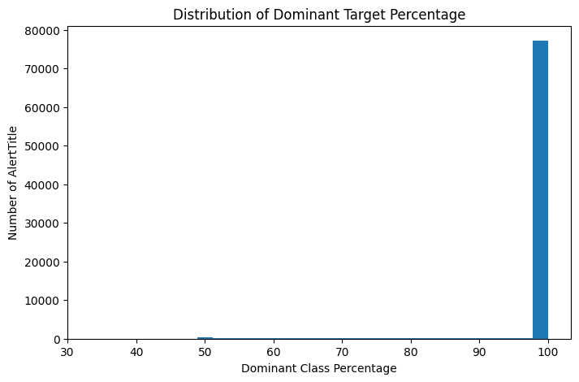

#### Purity Statistics
```python
print("100% Pure :", (result['max_target_pct'] == 100).sum())
print(">99% Pure :", (result['max_target_pct'] >= 99).sum())
print(">95% Pure :", (result['max_target_pct'] >= 95).sum())
print("<80% Pure :", (result['max_target_pct'] < 80).sum())
```
100% Pure : 77122
>99% Pure : 77168
>95% Pure : 77355
<80% Pure : 1844

#### Entrory Distribution

```python
p = result[target_cols].div(result['total_count'], axis=0)
result['entropy'] = -(p * np.log2(p.replace(0, np.nan))).sum(axis=1)
result[['AlertTitle','entropy']].head()
plt.figure(figsize=(8,5))
plt.hist(result['entropy'], bins=30)
plt.xlabel("Entropy")
plt.ylabel("Number of AlertTitles")
plt.title("Entropy Distribution Across AlertTitles")
plt.show()
```

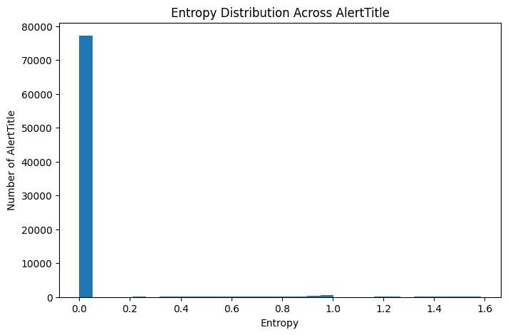

#### Target Distribtution for top 20 AlertTitles
```python
top = result.nlargest(20,'total_count')

plot_df = top.set_index('AlertTitle')[
    ['FalsePositive_pct',
     'BenignPositive_pct',
     'TruePositive_pct']
]
plot_df.plot(
    kind='bar',
    stacked=True,
    figsize=(12,5)
)
plt.ylabel("Percentage")
plt.title("Target Distribution for Top 20 AlertTitles")
plt.show()
```

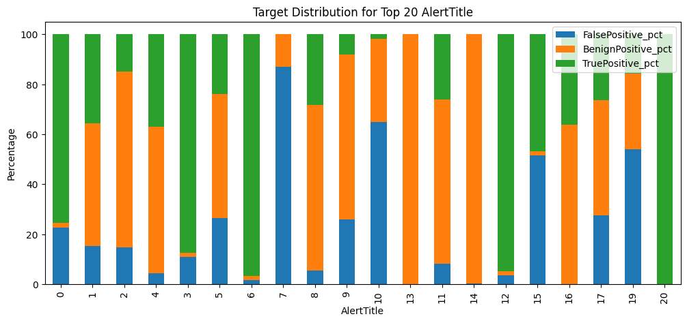

#### Dominant Class Count
```python
result['majority_class'].value_counts().plot.bar()
plt.ylabel("Number of AlertTitles")
plt.title("Dominant IncidentGrade per AlertTitle")
plt.show()
```
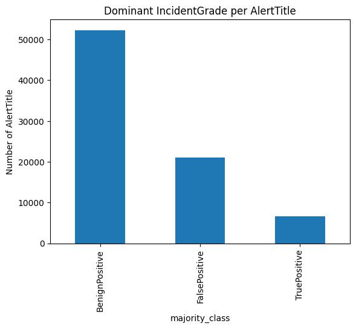

### Relationship with other numeric Cols
```python
corr_list = []

for chunk in chunk_dict.values():
    corr_list.append(chunk[numeric_cols].corr()['AlertTitle'])

AlertTitle_corr = pd.concat(corr_list, axis=1).mean(axis=1)
AlertTitle_corr = AlertTitle_corr.drop('AlertTitle').sort_values(key=abs, ascending=False)

print(AlertTitle_corr)
```
| Feature | Correlation |
|---|---:|
| DetectorId | 0.266036 |
| IncidentId | 0.137360 |
| IpAddress | 0.086313 |
| FolderPath | -0.077556 |
| AccountUpn | -0.076641 |
| CountryCode | 0.074766 |
| State | 0.068239 |
| City | 0.068162 |
| Url | 0.060791 |
| FileName | -0.033289 |
| DeviceId | 0.013059 |
| EmailClusterId | -0.012622 |
| OSFamily | 0.011968 |
| OSVersion | 0.011792 |
| OrgId | 0.011576 |
| Sha256 | 0.011300 |
| AccountName | -0.007628 |
| RegistryKey | 0.006884 |
| ApplicationName | -0.006560 |
| ApplicationId | -0.006231 |
| DeviceName | 0.002786 |
| RegistryValueName | -0.001178 |
| RegistryValueData | 0.000107 |

- Observation: The features show generally weak linear correlations with the target. DetectorId (0.266) has the strongest positive correlation, followed by IncidentId (0.137) and IpAddress (0.086). The strongest negative correlations are FolderPath (-0.078) and AccountUpn (-0.077), while most remaining correlations are close to zero. Overall, the features show limited linear dependence. Since most are high-cardinality identifiers or categorical variables, Pearson correlation should be treated as a descriptive measure only.

## AccountUpn

- No need for standardization.
- No missing values.
- Data type is `int64` in every chunk.

```python
for i in range(len(chunk_dict)):
    s = chunk_dict[i]["AccountUpn"]
    non_numeric = s[~s.apply(lambda x: isinstance(x, (int, float)))]
    print(non_numeric.unique())
```

### Cardinality

- Cardinality is extremely high considering the dataset size.
- Number of unique values varies highly across chunks.
- Taking the union across all chunks gives **530183 unique AccountUpn values** in the training data.

```python
for i in range(len(chunk_dict)):
    print(chunk_dict[i]["AccountUpn"].nunique())
```

### Frequency Distribution

```python
freq = (
    pd.concat([chunk_dict[i]['AccountUpn'] for i in chunk_dict])
    .value_counts(dropna=False)
    .rename('count')
    .reset_index()
)
freq=freq.sort_values('count',ascending=False)
freq['count_pct(%)']=((freq['count']/9516837)*100).round(3)
freq['cumsum_pct']=freq['count_pct(%)'].cumsum()
freq.columns = ['AccountUpn', 'count','count_pct(%)','cumsum_pct']
```

#### Top 50 AccountUpns

| AccountUpn | count | count_pct(%) | cumsum_pct |
|-----------:|------:|-------------:|-----------:|
| 673934 | 6050715 | 63.579 | 63.579 |
| 0      | 14469   | 0.152 | 63.731 |
| 1      | 9444    | 0.099 | 63.830 |
| 2      | 8542    | 0.090 | 63.920 |
| 4      | 7800    | 0.082 | 64.002 |
| 3      | 7797    | 0.082 | 64.084 |
| 5      | 7585    | 0.080 | 64.164 |
| 6      | 7487    | 0.079 | 64.243 |
| 7      | 7431    | 0.078 | 64.321 |
| 8      | 7298    | 0.077 | 64.398 |
| 9      | 7142    | 0.075 | 64.473 |
| 10     | 7100    | 0.075 | 64.548 |
| 11     | 6895    | 0.072 | 64.620 |
| 12     | 6859    | 0.072 | 64.692 |
| 13     | 6017    | 0.063 | 64.755 |
| 14     | 4715    | 0.050 | 64.805 |
| 15     | 4248    | 0.045 | 64.850 |
| 16     | 3770    | 0.040 | 64.890 |
| 23     | 2552    | 0.027 | 64.917 |
| 17     | 2474    | 0.026 | 64.943 |
| 21     | 2349    | 0.025 | 64.968 |
| 19     | 2261    | 0.024 | 64.992 |
| 24     | 2129    | 0.022 | 65.014 |
| 20     | 2102    | 0.022 | 65.036 |
| 27     | 1994    | 0.021 | 65.057 |
| 26     | 1987    | 0.021 | 65.078 |
| 29     | 1931    | 0.020 | 65.098 |
| 30     | 1924    | 0.020 | 65.118 |
| 28     | 1878    | 0.020 | 65.138 |
| 32     | 1861    | 0.020 | 65.158 |
| 34     | 1848    | 0.019 | 65.177 |
| 33     | 1821    | 0.019 | 65.196 |
| 36     | 1794    | 0.019 | 65.215 |
| 37     | 1777    | 0.019 | 65.234 |
| 38     | 1685    | 0.018 | 65.252 |
| 39     | 1631    | 0.017 | 65.269 |
| 42     | 1594    | 0.017 | 65.286 |
| 69     | 1550    | 0.016 | 65.302 |
| 43     | 1550    | 0.016 | 65.318 |
| 41     | 1512    | 0.016 | 65.334 |
| 48     | 1489    | 0.016 | 65.350 |
| 45     | 1478    | 0.016 | 65.366 |
| 46     | 1474    | 0.015 | 65.381 |
| 50     | 1451    | 0.015 | 65.396 |
| 44     | 1432    | 0.015 | 65.411 |
| 51     | 1380    | 0.015 | 65.426 |
| 57     | 1330    | 0.014 | 65.440 |
| 56     | 1295    | 0.014 | 65.454 |
| 52     | 1283    | 0.013 | 65.467 |
| 67     | 1266    | 0.013 | 65.480 |

### Observations

- 464796 categories appear fewer than 10 times.
- 383985 categories appear fewer than 5 times.
- Top 1 category contributes around 65% of the data.
- Top 50 categories contribute more than 65%.
- Total unique categories = **530183**.

| Appearance | Categories |
|-----------:|-----------:|
| 10000+ | 2 |
| 1000-10000 | 70 |
| 100-1000 | 2959 |
| 10-100 | 62356 |
| 5-10 | 80811 |
| 3-5 | 100032 |
| 1-3 | 283953 |

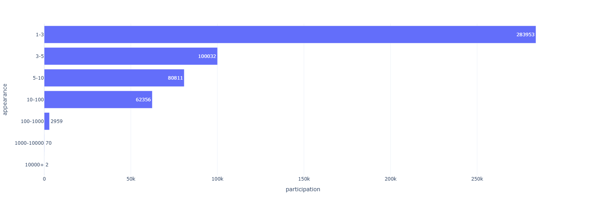

- Only AccountUpn appear on ~65% of the data

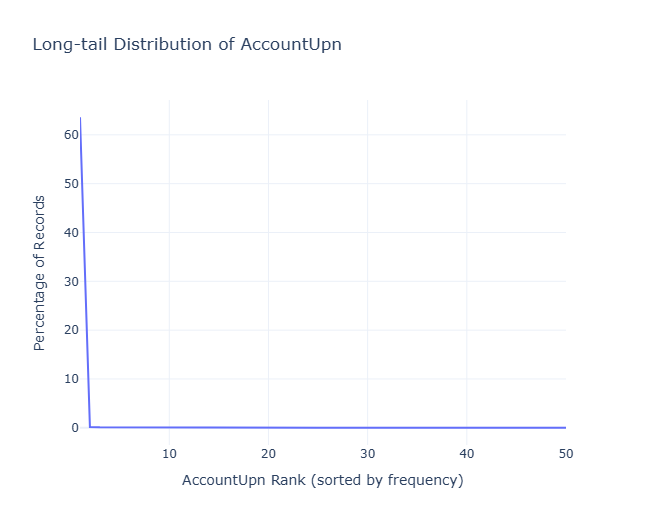

- This is Simply a drop in appearence as only first in top takes 65% appearence which looks like a peak and then immediate fall

### Target Distribution

```python
dfs = []

for i in range(len(chunk_dict)):
    df = chunk_dict[i][['AccountUpn', 'IncidentGrade']].copy()

    category_counts = (
        df.groupby(['AccountUpn', 'IncidentGrade'])
          .size()
          .unstack(fill_value=0)
    )

    dfs.append(category_counts)

result = (
    pd.concat(dfs)
      .groupby('AccountUpn')
      .sum()
      .reset_index()
)

result.columns.name = None
result['total_count']=result['FalsePositive']+result['BenignPositive']+result['TruePositive']
result['FalsePositive_pct']=((result['FalsePositive']/result['total_count'])*100).round(3)
result['BenignPositive_pct']=((result['BenignPositive']/result['total_count'])*100).round(3)
result['TruePositive_pct']=((result['TruePositive']/result['total_count'])*100).round(3)
```
#### Conditional Target Distribution (Target | AccountUpn)
- This analysis examines the conditional distribution of the target variable given the feature (P(Target | AccountUpn)). It helps identify AccountUpn whose incident labels are highly skewed toward a particular class, which can indicate that the feature has predictive power.

##### BenignPositive
- AccountUpn with more than 10,000 incidents were ranked by their BenignPositive percentage. Several AccountUpns exhibit a very high BenignPositive rate, suggesting a strong relationship between AccountUpn and the target variable.

```python
df=result[['AccountUpn','total_count','FalsePositive_pct','BenignPositive_pct','TruePositive_pct']][result['total_count']>10000]
BenignPositive_df=df.sort_values(by=['BenignPositive_pct','total_count'],ascending=[False,False])
BenignPositive_df.head(20)
```
| AccountUpn | total_count | FalsePositive_pct | BenignPositive_pct | TruePositive_pct |
|-----------:|------------:|------------------:|-------------------:|-----------------:|
| 0 | 14469 | 0.000 | **100.00** | 0.000 |
| 673934 | 6049063 | 22.008 | 41.105 | 36.887 |

##### FalsePositive
- AccountUpn with more than 10,000 incidents were ranked by their FalsePositive percentage. Several AccountUpns exhibit a very high FalsePositive rate, suggesting a strong relationship between AccountUpn and the target variable.
```python
FalsePositive_df=df.sort_values(by=['FalsePositive_pct','total_count'],ascending=[False,False])
FalsePositive_df.head(20)
```

| AccountUpn | total_count | FalsePositive_pct | BenignPositive_pct | TruePositive_pct |
|-----------:|------------:|------------------:|-------------------:|-----------------:|
| 673934 | 6049063 | 22.008 | 41.105 | 36.887 |
| 0 | 14469 | 0.000 | **100.00** | 0.000 |

##### TruePositive
- AccountUpn with more than 10,000 incidents were ranked by their TruePositive percentage. Several AccountUpns exhibit a very high TruePositive rate, suggesting a strong relationship between AccountUpn and the target variable.
```python
TruePositive_df=df.sort_values(by=['TruePositive_pct','total_count'],ascending=[False,False])
TruePositive_df.head(20)
```
| AccountUpn | total_count | FalsePositive_pct | BenignPositive_pct | TruePositive_pct |
|-----------:|------------:|------------------:|-------------------:|-----------------:|
| 673934 | 6049063 | 22.008 | 41.105 | 36.887 |
| 0 | 14469 | 0.000 | **100.00** | 0.000 |

#### Dominant Class Category
```python
target_cols = ['FalsePositive', 'BenignPositive', 'TruePositive']
result['max_target_pct'] = result[target_cols].max(axis=1) / result['total_count'] * 100
result['max_target_pct'].describe()
plt.figure(figsize=(8,5))
plt.hist(result['max_target_pct'], bins=30)
plt.xlabel("Dominant Class Percentage")
plt.ylabel("Number of AccountUpns")
plt.title("Distribution of Dominant Target Percentage")
plt.show()
```

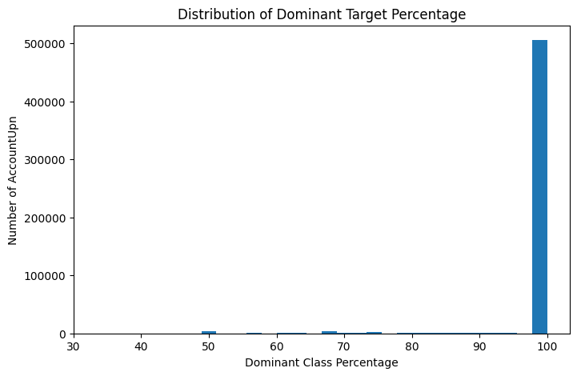

#### Purity Statistics
```python
print("100% Pure :", (result['max_target_pct'] == 100).sum())
print(">99% Pure :", (result['max_target_pct'] >= 99).sum())
print(">95% Pure :", (result['max_target_pct'] >= 95).sum())
print("<80% Pure :", (result['max_target_pct'] < 80).sum())
```
100% Pure : 505799
>99% Pure : 505837
>95% Pure : 506362
<80% Pure : 13751

#### Entrory Distribution

```python
p = result[target_cols].div(result['total_count'], axis=0)
result['entropy'] = -(p * np.log2(p.replace(0, np.nan))).sum(axis=1)
result[['AccountUpn','entropy']].head()
plt.figure(figsize=(8,5))
plt.hist(result['entropy'], bins=30)
plt.xlabel("Entropy")
plt.ylabel("Number of AccountUpns")
plt.title("Entropy Distribution Across AccountUpns")
plt.show()
```

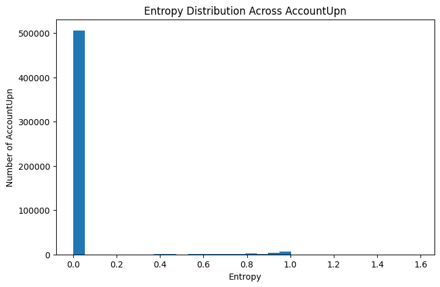

#### Target Distribtution for top 20 AccountUpns
```python
top = result.nlargest(20,'total_count')

plot_df = top.set_index('AccountUpn')[
    ['FalsePositive_pct',
     'BenignPositive_pct',
     'TruePositive_pct']
]
plot_df.plot(
    kind='bar',
    stacked=True,
    figsize=(12,5)
)
plt.ylabel("Percentage")
plt.title("Target Distribution for Top 20 AccountUpns")
plt.show()
```

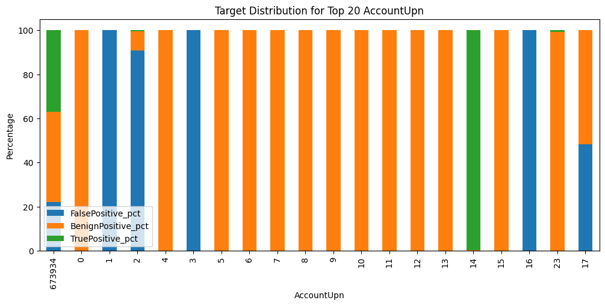

#### Dominant Class Count
```python
result['majority_class'].value_counts().plot.bar()
plt.ylabel("Number of AccountUpns")
plt.title("Dominant IncidentGrade per AccountUpn")
plt.show()
```
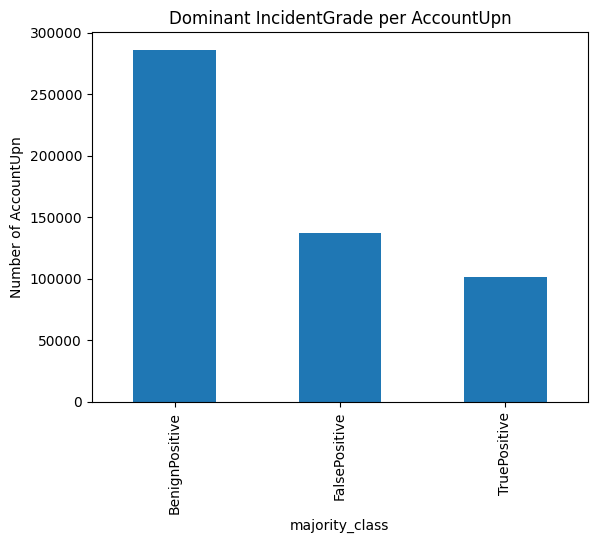

### Relationship with other numeric Cols
```python
corr_list = []

for chunk in chunk_dict.values():
    corr_list.append(chunk[numeric_cols].corr()['AccountUpn'])

AccountUpn_corr = pd.concat(corr_list, axis=1).mean(axis=1)
AccountUpn_corr = AccountUpn_corr.drop('AccountUpn').sort_values(key=abs, ascending=False)

print(AccountUpn_corr)
```
| Feature | Correlation |
|---|---:|
| AccountName | 0.726696 |
| IpAddress | -0.382707 |
| FileName | -0.241897 |
| FolderPath | -0.225342 |
| CountryCode | -0.210643 |
| Sha256 | -0.202853 |
| DeviceName | -0.197297 |
| Url | -0.193774 |
| State | -0.192299 |
| City | -0.192101 |
| DeviceId | -0.138394 |
| ApplicationName | -0.110673 |
| ApplicationId | -0.109102 |
| OSVersion | -0.104210 |
| OSFamily | -0.104134 |
| AlertTitle | -0.076641 |
| RegistryKey | -0.030615 |
| OrgId | -0.026347 |
| RegistryValueData | -0.016838 |
| RegistryValueName | -0.015232 |
| DetectorId | 0.014795 |
| IncidentId | -0.002896 |
| EmailClusterId | NaN |

- Observation: The features show mixed linear correlations with the target. AccountName (0.727) has the strongest positive correlation, while IpAddress (-0.383) has the strongest negative correlation, followed by FileName (-0.242) and FolderPath (-0.225). Most remaining features show weak correlations. Since these are primarily high-cardinality identifiers or categorical variables, Pearson correlation should be treated as a descriptive measure only.


## AccountName

- No need for standardization.
- No missing values.
- Data type is `int64` in every chunk.

```python
for i in range(len(chunk_dict)):
    s = chunk_dict[i]["AccountName"]
    non_numeric = s[~s.apply(lambda x: isinstance(x, (int, float)))]
    print(non_numeric.unique())
```

### Cardinality

- Cardinality is extremely high considering the dataset size.
- Number of unique values varies highly across chunks like each chunk only has around 90000-100000 only much lower than total uniques.
- Taking the union across all chunks gives **368250 unique AccountName values** in the training data.

```python
for i in range(len(chunk_dict)):
    print(chunk_dict[i]["AccountName"].nunique())
```

### Frequency Distribution

```python
freq = (
    pd.concat([chunk_dict[i]['AccountName'] for i in chunk_dict])
    .value_counts(dropna=False)
    .rename('count')
    .reset_index()
)
freq=freq.sort_values('count',ascending=False)
freq['count_pct(%)']=((freq['count']/9516837)*100).round(3)
freq['cumsum_pct']=freq['count_pct(%)'].cumsum()
freq.columns = ['AccountName', 'count','count_pct(%)','cumsum_pct']
```

#### Top 50 AccountNames

| AccountName | count | count_pct(%) | cumsum_pct |
|---:|---:|---:|---:|
| 453297 | 7,148,428 | 75.113 | 75.113 |
| 0 | 14,469 | 0.152 | 75.265 |
| 1 | 10,840 | 0.114 | 75.379 |
| 2 | 6,108 | 0.064 | 75.443 |
| 3 | 3,771 | 0.040 | 75.483 |
| 4 | 3,596 | 0.038 | 75.521 |
| 7 | 3,144 | 0.033 | 75.554 |
| 6 | 3,085 | 0.032 | 75.586 |
| 5 | 2,895 | 0.030 | 75.616 |
| 8 | 2,832 | 0.030 | 75.646 |
| 11 | 2,552 | 0.027 | 75.673 |
| 9 | 2,350 | 0.025 | 75.698 |
| 13 | 2,129 | 0.022 | 75.720 |
| 16 | 1,994 | 0.021 | 75.741 |
| 15 | 1,988 | 0.021 | 75.762 |
| 18 | 1,931 | 0.020 | 75.782 |
| 19 | 1,924 | 0.020 | 75.802 |
| 17 | 1,878 | 0.020 | 75.822 |
| 12 | 1,870 | 0.020 | 75.842 |
| 20 | 1,869 | 0.020 | 75.862 |
| 23 | 1,848 | 0.019 | 75.881 |
| 22 | 1,822 | 0.019 | 75.900 |
| 24 | 1,797 | 0.019 | 75.919 |
| 27 | 1,779 | 0.019 | 75.938 |
| 26 | 1,722 | 0.018 | 75.956 |
| 28 | 1,685 | 0.018 | 75.974 |
| 29 | 1,631 | 0.017 | 75.991 |
| 33 | 1,586 | 0.017 | 76.008 |
| 53 | 1,562 | 0.016 | 76.024 |
| 31 | 1,512 | 0.016 | 76.040 |
| 32 | 1,502 | 0.016 | 76.056 |
| 37 | 1,489 | 0.016 | 76.072 |
| 35 | 1,475 | 0.015 | 76.087 |
| 38 | 1,472 | 0.015 | 76.102 |
| 44 | 1,330 | 0.014 | 76.116 |
| 43 | 1,296 | 0.014 | 76.130 |
| 40 | 1,283 | 0.013 | 76.143 |
| 54 | 1,266 | 0.013 | 76.156 |
| 45 | 1,251 | 0.013 | 76.169 |
| 30 | 1,247 | 0.013 | 76.182 |
| 56 | 1,239 | 0.013 | 76.195 |
| 39 | 1,233 | 0.013 | 76.208 |
| 46 | 1,221 | 0.013 | 76.221 |
| 52 | 1,211 | 0.013 | 76.234 |
| 41 | 1,197 | 0.013 | 76.247 |
| 10 | 1,197 | 0.013 | 76.260 |
| 55 | 1,134 | 0.012 | 76.272 |
| 49 | 1,100 | 0.012 | 76.284 |
| 51 | 1,095 | 0.012 | 76.296 |
| 50 | 1,094 | 0.011 | 76.307 |

### Observations

- 326096 categories appear fewer than 10 times.
- 280324 categories appear fewer than 5 times.
- Top 1 category contributes around 75% of the data.
- Top 50 categories contribute more than 76%.
- Total unique categories = **368250**.

| Appearance | Categories |
|-----------:|-----------:|
| 10000+ | 3 |
| 1000-10000 | 53 |
| 100-1000 | 2349 |
| 10-100 | 39749 |
| 5-10 | 45772 |
| 3-5 | 66207 |
| 1-3 | 214117 |

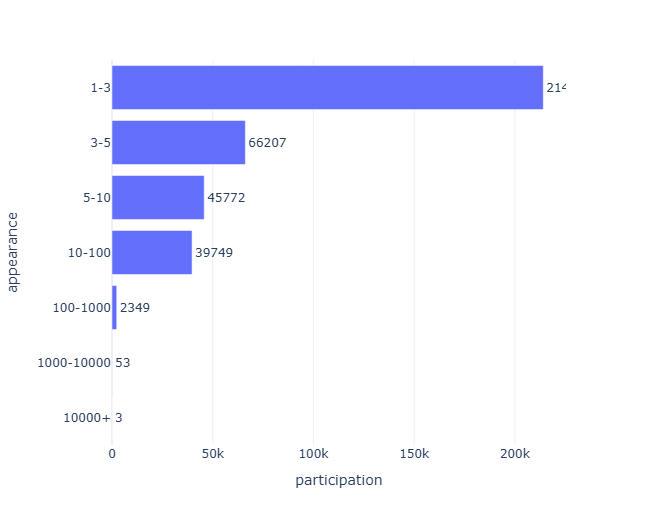

- Only 1 AccountName appear on ~75% of the data

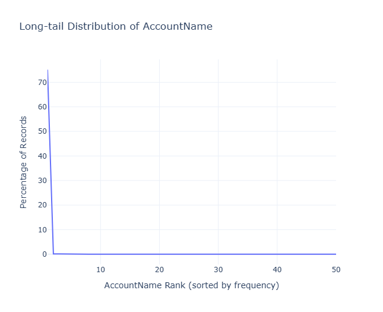

- This is Simply a drop in appearence as only first in top takes 75% appearence which looks like a peak and then immediate fall

### Target Distribution

```python
dfs = []

for i in range(len(chunk_dict)):
    df = chunk_dict[i][['AccountName', 'IncidentGrade']].copy()

    category_counts = (
        df.groupby(['AccountName', 'IncidentGrade'])
          .size()
          .unstack(fill_value=0)
    )

    dfs.append(category_counts)

result = (
    pd.concat(dfs)
      .groupby('AccountName')
      .sum()
      .reset_index()
)

result.columns.name = None
result['total_count']=result['FalsePositive']+result['BenignPositive']+result['TruePositive']
result['FalsePositive_pct']=((result['FalsePositive']/result['total_count'])*100).round(3)
result['BenignPositive_pct']=((result['BenignPositive']/result['total_count'])*100).round(3)
result['TruePositive_pct']=((result['TruePositive']/result['total_count'])*100).round(3)
```
#### Conditional Target Distribution (Target | AccountName)
- This analysis examines the conditional distribution of the target variable given the feature (P(Target | AccountName)). It helps identify AccountName whose incident labels are highly skewed toward a particular class, which can indicate that the feature has predictive power.

##### BenignPositive
- AccountName with more than 10,000 incidents were ranked by their BenignPositive percentage. Several AccountNames exhibit a very high BenignPositive rate, suggesting a strong relationship between AccountName and the target variable.

```python
df=result[['AccountName','total_count','FalsePositive_pct','BenignPositive_pct','TruePositive_pct']][result['total_count']>10000]
BenignPositive_df=df.sort_values(by=['BenignPositive_pct','total_count'],ascending=[False,False])
BenignPositive_df.head(20)
```
| AccountName | total_count | FalsePositive_pct | BenignPositive_pct | TruePositive_pct |
|---:|---:|---:|---:|---:|
| 0 | 14,469 | 0.000 | **100.000** | 0.000 |
| 453297 | 7,146,807 | 22.063 | 44.325 | 33.612 |
| 1 | 10,840 | **100.000** | 0.000 | 0.000 |

##### FalsePositive
- AccountName with more than 10,000 incidents were ranked by their FalsePositive percentage. Several AccountNames exhibit a very high FalsePositive rate, suggesting a strong relationship between AccountName and the target variable.
```python
FalsePositive_df=df.sort_values(by=['FalsePositive_pct','total_count'],ascending=[False,False])
FalsePositive_df.head(20)
```

| AccountName | total_count | FalsePositive_pct | BenignPositive_pct | TruePositive_pct |
|---:|---:|---:|---:|---:|
| 1 | 10,840 | **100.000** | 0.000 | 0.000 |
| 453297 | 7,146,807 | 22.063 | 44.325 | 33.612 |
| 0 | 14,469 | 0.000 | **100.000** | 0.000 |

##### TruePositive
- AccountName with more than 10,000 incidents were ranked by their TruePositive percentage. Several AccountNames exhibit a very high TruePositive rate, suggesting a strong relationship between AccountName and the target variable.
```python
TruePositive_df=df.sort_values(by=['TruePositive_pct','total_count'],ascending=[False,False])
TruePositive_df.head(20)
```
| AccountName | total_count | FalsePositive_pct | BenignPositive_pct | TruePositive_pct |
|---:|---:|---:|---:|---:|
| 453297 | 7,146,807 | 22.063 | 44.325 | 33.612 |
| 0 | 14,469 | 0.000 | **100.000** | 0.000 |
| 1 | 10,840 | **100.000** | 0.000 | 0.000 |

#### Dominant Class Category
```python
target_cols = ['FalsePositive', 'BenignPositive', 'TruePositive']
result['max_target_pct'] = result[target_cols].max(axis=1) / result['total_count'] * 100
result['max_target_pct'].describe()
plt.figure(figsize=(8,5))
plt.hist(result['max_target_pct'], bins=30)
plt.xlabel("Dominant Class Percentage")
plt.ylabel("Number of AccountNames")
plt.title("Distribution of Dominant Target Percentage")
plt.show()
```


#### Purity Statistics
```python
print("100% Pure :", (result['max_target_pct'] == 100).sum())
print(">99% Pure :", (result['max_target_pct'] >= 99).sum())
print(">95% Pure :", (result['max_target_pct'] >= 95).sum())
print("<80% Pure :", (result['max_target_pct'] < 80).sum())
```
100% Pure : 339700
>99% Pure : 339747
>95% Pure : 340347
<80% Pure : 17300

#### Entrory Distribution

```python
p = result[target_cols].div(result['total_count'], axis=0)
result['entropy'] = -(p * np.log2(p.replace(0, np.nan))).sum(axis=1)
result[['AccountName','entropy']].head()
plt.figure(figsize=(8,5))
plt.hist(result['entropy'], bins=30)
plt.xlabel("Entropy")
plt.ylabel("Number of AccountNames")
plt.title("Entropy Distribution Across AccountNames")
plt.show()
```

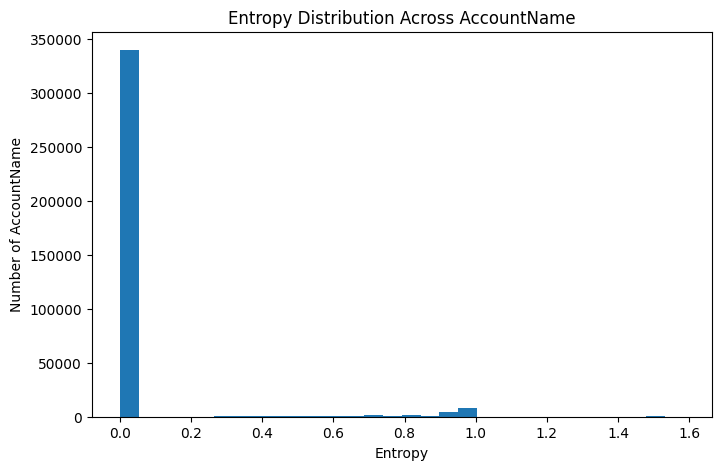

#### Target Distribtution for top 20 AccountNames
```python
top = result.nlargest(20,'total_count')

plot_df = top.set_index('AccountName')[
    ['FalsePositive_pct',
     'BenignPositive_pct',
     'TruePositive_pct']
]
plot_df.plot(
    kind='bar',
    stacked=True,
    figsize=(12,5)
)
plt.ylabel("Percentage")
plt.title("Target Distribution for Top 20 AccountNames")
plt.show()
```

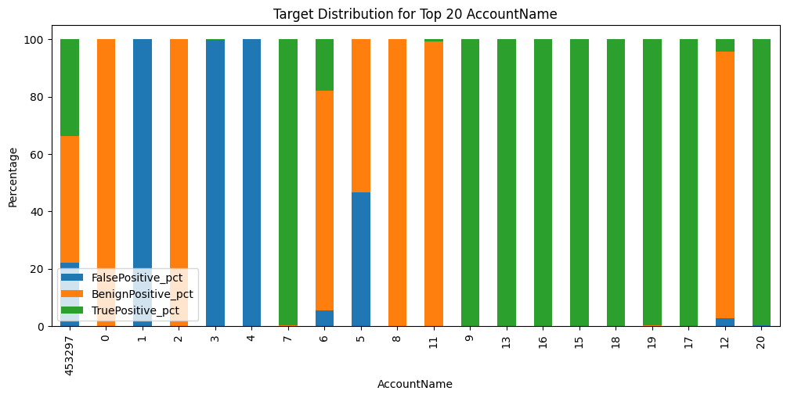

#### Dominant Class Count
```python
result['majority_class'].value_counts().plot.bar()
plt.ylabel("Number of AccountNames")
plt.title("Dominant IncidentGrade per AccountName")
plt.show()
```
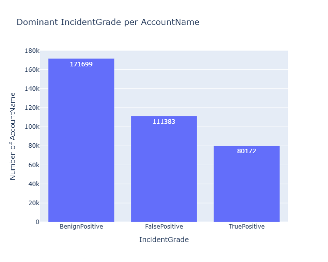

### Relationship with other numeric Cols
```python
corr_list = []

for chunk in chunk_dict.values():
    corr_list.append(chunk[numeric_cols].corr()['AccountName'])

AccountName_corr = pd.concat(corr_list, axis=1).mean(axis=1)
AccountName_corr = AccountName_corr.drop('AccountName').sort_values(key=abs, ascending=False)

print(AccountName_corr)
```
| Feature | Correlation |
|---|---:|
| **AccountUpn** | **0.726696** |
| IpAddress | -0.292664 |
| FileName | -0.184984 |
| FolderPath | -0.172324 |
| CountryCode | -0.161083 |
| Sha256 | -0.155127 |
| DeviceName | -0.150878 |
| Url | -0.148183 |
| State | -0.147055 |
| City | -0.146904 |
| DeviceId | -0.105833 |
| ApplicationName | -0.084634 |
| ApplicationId | -0.083433 |
| OSVersion | -0.079692 |
| OSFamily | -0.079634 |
| OrgId | -0.038584 |
| IncidentId | -0.034857 |
| RegistryKey | -0.023412 |
| DetectorId | -0.015046 |
| RegistryValueData | -0.012876 |
| RegistryValueName | -0.011648 |
| AlertTitle | -0.007628 |
| EmailClusterId | NaN |

- Observation: The features exhibit mixed linear correlations with the target. AccountUpn (0.727) shows the strongest positive correlation, while IpAddress (-0.293) has the strongest negative correlation, followed by FileName (-0.185) and FolderPath (-0.172). Most of the remaining features have relatively weak correlations. Because these features are largely high-cardinality identifiers or categorical variables, Pearson correlation should be interpreted as a descriptive measure rather than evidence of a meaningful relationship or causation.

## Sha256

- No need for standardization.
- No missing values.
- Data type is `int64` in every chunk.

```python
for i in range(len(chunk_dict)):
    s = chunk_dict[i]["Sha256"]
    non_numeric = s[~s.apply(lambda x: isinstance(x, (int, float)))]
    print(non_numeric.unique())
```

### Cardinality

- Cardinality is very high considering the dataset size.
- Number of unique values varies highly across chunks each chunks appears to be containing ~20000 uniques values of Sha256 5 times lower than total nuniques.
- Taking the union across all chunks gives **106416 unique Sha256 values** in the training data.

```python
for i in range(len(chunk_dict)):
    print(chunk_dict[i]["Sha256"].nunique())
```

### Frequency Distribution

```python
freq = (
    pd.concat([chunk_dict[i]['Sha256'] for i in chunk_dict])
    .value_counts(dropna=False)
    .rename('count')
    .reset_index()
)
freq=freq.sort_values('count',ascending=False)
freq['count_pct(%)']=((freq['count']/9516837)*100).round(3)
freq['cumsum_pct']=freq['count_pct(%)'].cumsum()
freq.columns = ['Sha256', 'count','count_pct(%)','cumsum_pct']
```

#### Top 50 Sha256s

| Sha256 | count | count_pct(%) | cumsum_pct |
|---:|---:|---:|---:|
| 138268 | 8,781,572 | 92.274 | 92.274 |
| 0 | 50,483 | 0.530 | 92.804 |
| 1 | 27,592 | 0.290 | 93.094 |
| 2 | 15,918 | 0.167 | 93.261 |
| 3 | 15,306 | 0.161 | 93.422 |
| 4 | 11,444 | 0.120 | 93.542 |
| 5 | 8,545 | 0.090 | 93.632 |
| 6 | 7,579 | 0.080 | 93.712 |
| 7 | 7,469 | 0.078 | 93.790 |
| 8 | 7,413 | 0.078 | 93.868 |
| 12 | 5,058 | 0.053 | 93.921 |
| 10 | 5,015 | 0.053 | 93.974 |
| 11 | 4,964 | 0.052 | 94.026 |
| 9 | 4,944 | 0.052 | 94.078 |
| 13 | 4,403 | 0.046 | 94.124 |
| 15 | 4,080 | 0.043 | 94.167 |
| 14 | 4,056 | 0.043 | 94.210 |
| 16 | 3,585 | 0.038 | 94.248 |
| 19 | 3,173 | 0.033 | 94.281 |
| 17 | 2,742 | 0.029 | 94.310 |
| 18 | 2,609 | 0.027 | 94.337 |
| 20 | 2,469 | 0.026 | 94.363 |
| 21 | 2,412 | 0.025 | 94.388 |
| 23 | 2,101 | 0.022 | 94.410 |
| 34 | 2,086 | 0.022 | 94.432 |
| 24 | 2,055 | 0.022 | 94.454 |
| 22 | 2,051 | 0.022 | 94.476 |
| 26 | 1,914 | 0.020 | 94.496 |
| 29 | 1,910 | 0.020 | 94.516 |
| 28 | 1,910 | 0.020 | 94.536 |
| 30 | 1,910 | 0.020 | 94.556 |
| 31 | 1,910 | 0.020 | 94.576 |
| 27 | 1,882 | 0.020 | 94.596 |
| 25 | 1,810 | 0.019 | 94.615 |
| 33 | 1,810 | 0.019 | 94.634 |
| 32 | 1,706 | 0.018 | 94.652 |
| 37 | 1,696 | 0.018 | 94.670 |
| 39 | 1,693 | 0.018 | 94.688 |
| 38 | 1,634 | 0.017 | 94.705 |
| 35 | 1,627 | 0.017 | 94.722 |
| 36 | 1,627 | 0.017 | 94.739 |
| 42 | 1,599 | 0.017 | 94.756 |
| 40 | 1,541 | 0.016 | 94.772 |
| 41 | 1,502 | 0.016 | 94.788 |
| 44 | 1,493 | 0.016 | 94.804 |
| 46 | 1,394 | 0.015 | 94.819 |
| 51 | 1,377 | 0.014 | 94.833 |
| 45 | 1,343 | 0.014 | 94.847 |
| 47 | 1,336 | 0.014 | 94.861 |
| 55 | 1,314 | 0.014 | 94.875 |

### Observations

- 99831 categories appear fewer than 10 times.
- 90758 categories appear fewer than 5 times.
- Top 1 category contribute around 92% of the data.
- Top 50 categories contribute more than 94%.
- Total unique categories = **106416**.

| Appearance | Categories |
|-----------:|-----------:|
| 10000+ | 6 |
| 1000-10000 | 52 |
| 100-1000 | 553 |
| 10-100 | 5974 |
| 5-10 | 9073 |
| 3-5 | 16185 |
| 1-3 | 74575 |

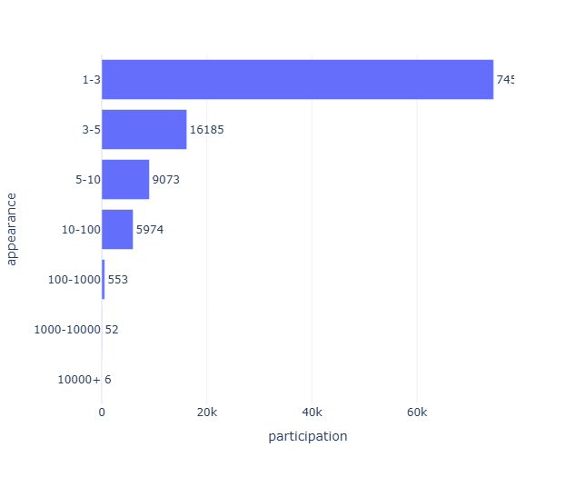

- Nearly 1 Sha256s appear on ~92% of the data

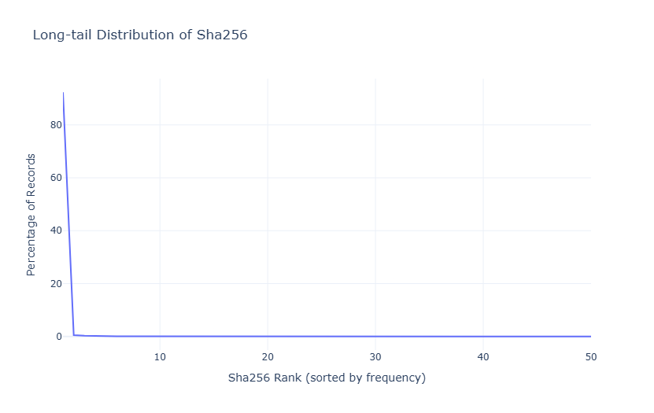

- We can observe how thin the line gets even when we plotted it on top 50 proving the skewness of the data, only 1 category has almost complete participation and then a sudden drop

### Target Distribution

```python
dfs = []

for i in range(len(chunk_dict)):
    df = chunk_dict[i][['Sha256', 'IncidentGrade']].copy()

    category_counts = (
        df.groupby(['Sha256', 'IncidentGrade'])
          .size()
          .unstack(fill_value=0)
    )

    dfs.append(category_counts)

result = (
    pd.concat(dfs)
      .groupby('Sha256')
      .sum()
      .reset_index()
)

result.columns.name = None
result['total_count']=result['FalsePositive']+result['BenignPositive']+result['TruePositive']
result['FalsePositive_pct']=((result['FalsePositive']/result['total_count'])*100).round(3)
result['BenignPositive_pct']=((result['BenignPositive']/result['total_count'])*100).round(3)
result['TruePositive_pct']=((result['TruePositive']/result['total_count'])*100).round(3)
```
#### Conditional Target Distribution (Target | Sha256)
- This analysis examines the conditional distribution of the target variable given the feature (P(Target | Sha256)). It helps identify Sha256 whose incident labels are highly skewed toward a particular class, which can indicate that the feature has predictive power.

##### BenignPositive
- Sha256 with more than 10,000 incidents were ranked by their BenignPositive percentage. Several Sha256s exhibit a very high BenignPositive rate, suggesting a strong relationship between Sha256 and the target variable.

```python
df=result[['Sha256','total_count','FalsePositive_pct','BenignPositive_pct','TruePositive_pct']][result['total_count']>10000]
BenignPositive_df=df.sort_values(by=['BenignPositive_pct','total_count'],ascending=[False,False])
BenignPositive_df.head(20)
```
| Sha256 | total_count | FalsePositive_pct | BenignPositive_pct | TruePositive_pct |
|---:|---:|---:|---:|---:|
| 4 | 11,444 | 0.105 | **99.878** | 0.017 |
| 3 | 15,306 | 11.930 | 78.374 | 9.696 |
| 2 | 15,918 | 11.616 | 76.165 | 12.219 |
| 1 | 27,592 | 12.399 | 74.768 | 12.833 |
| 0 | 50,483 | 14.742 | 64.598 | 20.660 |
| 138268 | 8,730,233 | 21.732 | 41.505 | 36.764 |

##### FalsePositive
- Sha256 with more than 10,000 incidents were ranked by their FalsePositive percentage. Several Sha256s exhibit a very high FalsePositive rate, suggesting a strong relationship between Sha256 and the target variable.
```python
FalsePositive_df=df.sort_values(by=['FalsePositive_pct','total_count'],ascending=[False,False])
FalsePositive_df.head(20)
```

| Sha256 | total_count | FalsePositive_pct | BenignPositive_pct | TruePositive_pct |
|---:|---:|---:|---:|---:|
| 138268 | 8,730,233 | **21.732** | 41.505 | 36.764 |
| 0 | 50,483 | 14.742 | 64.598 | 20.660 |
| 1 | 27,592 | 12.399 | 74.768 | 12.833 |
| 3 | 15,306 | 11.930 | 78.374 | 9.696 |
| 2 | 15,918 | 11.616 | 76.165 | 12.219 |
| 4 | 11,444 | 0.105 | **99.878** | 0.017 |

##### TruePositive
- Sha256 with more than 10,000 incidents were ranked by their TruePositive percentage. Several Sha256s exhibit a very high TruePositive rate, suggesting a strong relationship between Sha256 and the target variable.
```python
TruePositive_df=df.sort_values(by=['TruePositive_pct','total_count'],ascending=[False,False])
TruePositive_df.head(20)
```
| Sha256 | total_count | FalsePositive_pct | BenignPositive_pct | TruePositive_pct |
|---:|---:|---:|---:|---:|
| 138268 | 8,730,233 | **21.732** | 41.505 | 36.764 |
| 0 | 50,483 | 14.742 | 64.598 | 20.660 |
| 1 | 27,592 | 12.399 | 74.768 | 12.833 |
| 3 | 15,306 | 11.930 | 78.374 | 9.696 |
| 2 | 15,918 | 11.616 | 76.165 | 12.219 |
| 4 | 11,444 | 0.105 | **99.878** | 0.017 |

#### Dominant Class Category
```python
target_cols = ['FalsePositive', 'BenignPositive', 'TruePositive']
result['max_target_pct'] = result[target_cols].max(axis=1) / result['total_count'] * 100
result['max_target_pct'].describe()
plt.figure(figsize=(8,5))
plt.hist(result['max_target_pct'], bins=30)
plt.xlabel("Dominant Class Percentage")
plt.ylabel("Number of Sha256s")
plt.title("Distribution of Dominant Target Percentage")
plt.show()
```

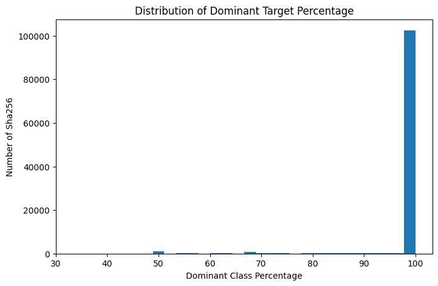

#### Purity Statistics
```python
print("100% Pure :", (result['max_target_pct'] == 100).sum())
print(">99% Pure :", (result['max_target_pct'] >= 99).sum())
print(">95% Pure :", (result['max_target_pct'] >= 95).sum())
print("<80% Pure :", (result['max_target_pct'] < 80).sum())
```
100% Pure : 102362
>99% Pure : 102381
>95% Pure : 102531
<80% Pure : 3070

#### Entrory Distribution

```python
p = result[target_cols].div(result['total_count'], axis=0)
result['entropy'] = -(p * np.log2(p.replace(0, np.nan))).sum(axis=1)
result[['Sha256','entropy']].head()
plt.figure(figsize=(8,5))
plt.hist(result['entropy'], bins=30)
plt.xlabel("Entropy")
plt.ylabel("Number of Sha256s")
plt.title("Entropy Distribution Across Sha256s")
plt.show()
```

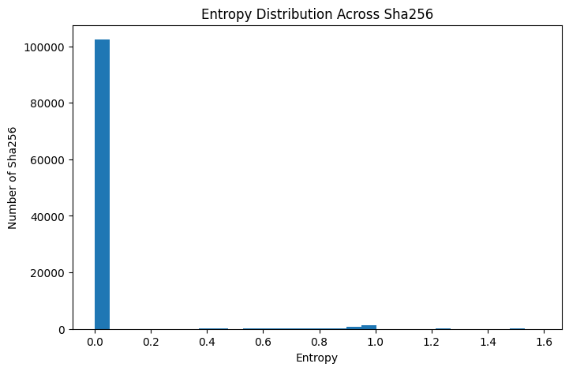

#### Target Distribtution for top 20 Sha256s
```python
top = result.nlargest(20,'total_count')

plot_df = top.set_index('Sha256')[
    ['FalsePositive_pct',
     'BenignPositive_pct',
     'TruePositive_pct']
]
plot_df.plot(
    kind='bar',
    stacked=True,
    figsize=(12,5)
)
plt.ylabel("Percentage")
plt.title("Target Distribution for Top 20 Sha256s")
plt.show()
```

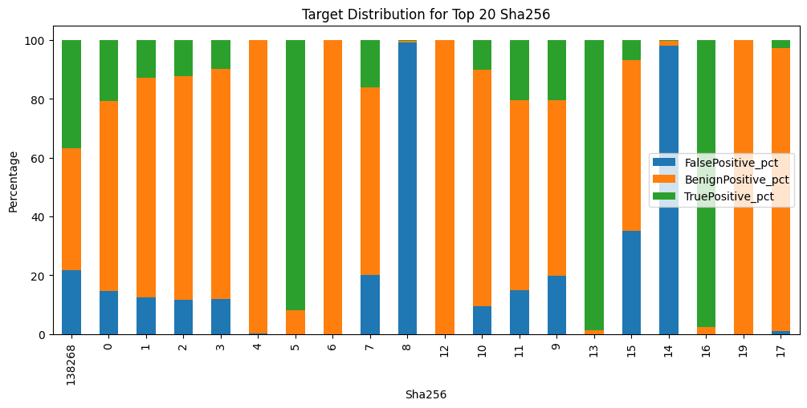

#### Dominant Class Count
```python
result['majority_class'].value_counts().plot.bar()
plt.ylabel("Number of Sha256s")
plt.title("Dominant IncidentGrade per Sha256")
plt.show()
```
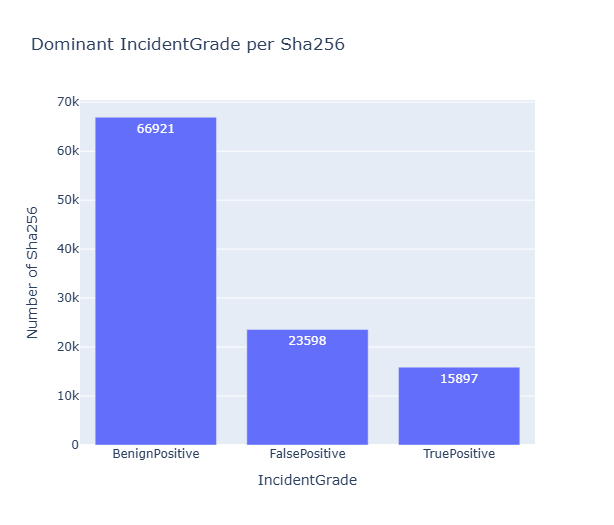

### Relationship with other numeric Cols
```python
corr_list = []

for chunk in chunk_dict.values():
    corr_list.append(chunk[numeric_cols].corr()['Sha256'])

Sha256_corr = pd.concat(corr_list, axis=1).mean(axis=1)
Sha256_corr = Sha256_corr.drop('Sha256').sort_values(key=abs, ascending=False)

print(Sha256_corr)
```
| Feature | Correlation |
|---|---:|
| **FileName** | **0.864043** |
| **FolderPath** | **0.751187** |
| AccountUpn | -0.202853 |
| AccountName | -0.155127 |
| IpAddress | -0.148903 |
| CountryCode | -0.081957 |
| DeviceName | -0.076764 |
| Url | -0.075364 |
| State | -0.074819 |
| City | -0.074742 |
| DeviceId | -0.053846 |
| ApplicationName | -0.043060 |
| ApplicationId | -0.042449 |
| OSVersion | -0.040546 |
| OSFamily | -0.040517 |
| IncidentId | -0.024234 |
| DetectorId | -0.021057 |
| RegistryKey | -0.011912 |
| AlertTitle | 0.011300 |
| RegistryValueData | -0.006551 |
| RegistryValueName | -0.005926 |
| OrgId | 0.002955 |
| EmailClusterId | NaN |

- Observation: The features exhibit mixed linear correlations with the target. FileName (0.864) shows the strongest positive correlation, followed by FolderPath (0.751). AccountUpn (-0.203) has the strongest negative correlation, followed by AccountName (-0.155) and IpAddress (-0.149). Most remaining features show weak correlations close to zero. Since these features are largely categorical or high-cardinality identifiers, Pearson correlation should be interpreted as a descriptive measure only, rather than evidence of a meaningful relationship or causation.


## RegistryKey

- No need for standardization.
- No missing values.
- Data type is `int64` in every chunk.

```python
for i in range(len(chunk_dict)):
    s = chunk_dict[i]["RegistryKey"]
    non_numeric = s[~s.apply(lambda x: isinstance(x, (int, float)))]
    print(non_numeric.unique())
```

### Cardinality

- Cardinality is not that high considering the dataset size.
- Number of unique values varies highly across chunks each chunks appears to be containing ~300 uniques values of RegistryKey 3 times lower than total nuniques.
- Taking the union across all chunks gives **1341 unique RegistryKey values** in the training data.

```python
for i in range(len(chunk_dict)):
    print(chunk_dict[i]["RegistryKey"].nunique())
```

### Frequency Distribution

```python
freq = (
    pd.concat([chunk_dict[i]['RegistryKey'] for i in chunk_dict])
    .value_counts(dropna=False)
    .rename('count')
    .reset_index()
)
freq=freq.sort_values('count',ascending=False)
freq['count_pct(%)']=((freq['count']/9516837)*100).round(3)
freq['cumsum_pct']=freq['count_pct(%)'].cumsum()
freq.columns = ['RegistryKey', 'count','count_pct(%)','cumsum_pct']
```

#### Top 50 RegistryKeys

| RegistryKey | count | count_pct(%) | cumsum_pct |
|---:|---:|---:|---:|
| 0 | 1631 | 9496737 | 99.789 |
| 1 | 0 | 11076 | 0.116 | 99.905 |
| 2 | 1 | 245 | 0.003 | 99.908 |
| 3 | 3 | 235 | 0.002 | 99.910 |
| 4 | 6 | 141 | 0.001 | 99.911 |
| 5 | 4 | 136 | 0.001 | 99.912 |
| 6 | 5 | 131 | 0.001 | 99.913 |
| 7 | 8 | 118 | 0.001 | 99.914 |
| 8 | 7 | 98 | 0.001 | 99.915 |
| 9 | 12 | 75 | 0.001 | 99.916 |
| 10 | 9 | 70 | 0.001 | 99.917 |
| 11 | 11 | 66 | 0.001 | 99.918 |
| 12 | 10 | 66 | 0.001 | 99.919 |
| 13 | 15 | 58 | 0.001 | 99.920 |
| 14 | 2 | 53 | 0.001 | 99.921 |
| 15 | 13 | 44 | 0.000 | 99.921 |
| 16 | 16 | 40 | 0.000 | 99.921 |
| 18 | 17 | 36 | 0.000 | 99.921 |
| 17 | 24 | 36 | 0.000 | 99.921 |
| 20 | 25 | 34 | 0.000 | 99.921 |
| 19 | 36 | 34 | 0.000 | 99.921 |
| 22 | 20 | 32 | 0.000 | 99.921 |
| 21 | 34 | 32 | 0.000 | 99.921 |
| 23 | 19 | 31 | 0.000 | 99.921 |
| 24 | 35 | 29 | 0.000 | 99.921 |
| 26 | 29 | 28 | 0.000 | 99.921 |
| 25 | 37 | 28 | 0.000 | 99.921 |
| 27 | 28 | 28 | 0.000 | 99.921 |
| 28 | 62 | 27 | 0.000 | 99.921 |
| 30 | 18 | 26 | 0.000 | 99.921 |
| 29 | 27 | 26 | 0.000 | 99.921 |
| 32 | 30 | 24 | 0.000 | 99.921 |
| 31 | 45 | 24 | 0.000 | 99.921 |
| 34 | 26 | 23 | 0.000 | 99.921 |
| 33 | 61 | 23 | 0.000 | 99.921 |
| 35 | 23 | 22 | 0.000 | 99.921 |
| 39 | 33 | 22 | 0.000 | 99.921 |
| 37 | 42 | 22 | 0.000 | 99.921 |
| 38 | 46 | 22 | 0.000 | 99.921 |
| 36 | 63 | 22 | 0.000 | 99.921 |
| 45 | 75 | 21 | 0.000 | 99.921 |
| 44 | 68 | 21 | 0.000 | 99.921 |
| 41 | 77 | 21 | 0.000 | 99.921 |
| 43 | 78 | 21 | 0.000 | 99.921 |
| 42 | 74 | 21 | 0.000 | 99.921 |
| 40 | 79 | 21 | 0.000 | 99.921 |
| 48 | 73 | 21 | 0.000 | 99.921 |
| 47 | 76 | 21 | 0.000 | 99.921 |
| 49 | 72 | 21 | 0.000 | 99.921 |
| 46 | 71 | 21 | 0.000 | 99.921 |

### Observations

- 99831 categories appear fewer than 10 times.
- 90758 categories appear fewer than 5 times.
- Top 1 category contribute around 92% of the data.
- Top 50 categories contribute more than 94%.
- Total unique categories = **106416**.

| Appearance | Categories |
|-----------:|-----------:|
| 10000+ | 6 |
| 1000-10000 | 52 |
| 100-1000 | 553 |
| 10-100 | 5974 |
| 5-10 | 9073 |
| 3-5 | 16185 |
| 1-3 | 74575 |

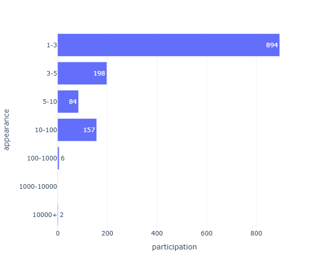

- Nearly 1 RegistryKeys appear on ~99% of the data

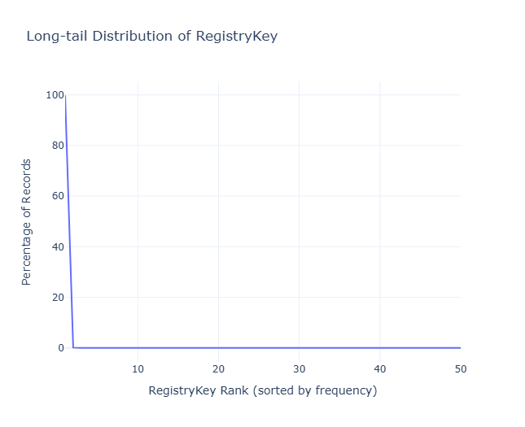

- The RegistryKey feature is highly right-skewed. Approximately 99.8% of the observations are concentrated at a single value (RegistryKey = 0), while the remaining values occur very infrequently. This indicates a strong class imbalance and suggests that RegistryKey has very low variability for the majority of records. For modeling, this feature may have limited predictive value unless the rare RegistryKey values carry meaningful information.

### Target Distribution

```python
dfs = []

for i in range(len(chunk_dict)):
    df = chunk_dict[i][['RegistryKey', 'IncidentGrade']].copy()

    category_counts = (
        df.groupby(['RegistryKey', 'IncidentGrade'])
          .size()
          .unstack(fill_value=0)
    )

    dfs.append(category_counts)

result = (
    pd.concat(dfs)
      .groupby('RegistryKey')
      .sum()
      .reset_index()
)

result.columns.name = None
result['total_count']=result['FalsePositive']+result['BenignPositive']+result['TruePositive']
result['FalsePositive_pct']=((result['FalsePositive']/result['total_count'])*100).round(3)
result['BenignPositive_pct']=((result['BenignPositive']/result['total_count'])*100).round(3)
result['TruePositive_pct']=((result['TruePositive']/result['total_count'])*100).round(3)
```
#### Conditional Target Distribution (Target | RegistryKey)
- This analysis examines the conditional distribution of the target variable given the feature (P(Target | RegistryKey)). It helps identify RegistryKey whose incident labels are highly skewed toward a particular class, which can indicate that the feature has predictive power.

##### BenignPositive
- RegistryKey with more than 10,000 incidents were ranked by their BenignPositive percentage. Several RegistryKeys exhibit a very high BenignPositive rate, suggesting a strong relationship between RegistryKey and the target variable.

```python
df=result[['RegistryKey','total_count','FalsePositive_pct','BenignPositive_pct','TruePositive_pct']][result['total_count']>10000]
BenignPositive_df=df.sort_values(by=['BenignPositive_pct','total_count'],ascending=[False,False])
BenignPositive_df.head(20)
```
| RegistryKey | total_count | FalsePositive_pct | BenignPositive_pct | TruePositive_pct |
|---:|---:|---:|---:|---:|
| 1631 | 9445398 | 21.366 | 43.491 | 35.143 |
| 0 | 11076 | 99.639 | 0.361 | 0.000 |

##### FalsePositive
- RegistryKey with more than 10,000 incidents were ranked by their FalsePositive percentage. Several RegistryKeys exhibit a very high FalsePositive rate, suggesting a strong relationship between RegistryKey and the target variable.
```python
FalsePositive_df=df.sort_values(by=['FalsePositive_pct','total_count'],ascending=[False,False])
FalsePositive_df.head(20)
```


| RegistryKey | total_count | FalsePositive_pct | BenignPositive_pct | TruePositive_pct |
|---:|---:|---:|---:|---:|
| 0 | 11076 | 99.639 | 0.361 | 0.000 |
| 1631 | 9445398 | 21.366 | 43.491 | 35.143 |

##### TruePositive
- RegistryKey with more than 10,000 incidents were ranked by their TruePositive percentage. Several RegistryKeys exhibit a very high TruePositive rate, suggesting a strong relationship between RegistryKey and the target variable.
```python
TruePositive_df=df.sort_values(by=['TruePositive_pct','total_count'],ascending=[False,False])
TruePositive_df.head(20)
```
| RegistryKey | total_count | FalsePositive_pct | BenignPositive_pct | TruePositive_pct |
|---:|---:|---:|---:|---:|
| 1631 | 9445398 | 21.366 | 43.491 | 35.143 |
| 0 | 11076 | 99.639 | 0.361 | 0.000 |

- RegistryKey = 1631 is associated with substantially higher BenignPositive (43.49%) and TruePositive (35.14%) rates, while RegistryKey = 0 is overwhelmingly associated with FalsePositive (99.64%) cases. This indicates that RegistryKey is a strong discriminator between outcomes.
#### Dominant Class Category
```python
target_cols = ['FalsePositive', 'BenignPositive', 'TruePositive']
result['max_target_pct'] = result[target_cols].max(axis=1) / result['total_count'] * 100
result['max_target_pct'].describe()
plt.figure(figsize=(8,5))
plt.hist(result['max_target_pct'], bins=30)
plt.xlabel("Dominant Class Percentage")
plt.ylabel("Number of RegistryKeys")
plt.title("Distribution of Dominant Target Percentage")
plt.show()
```

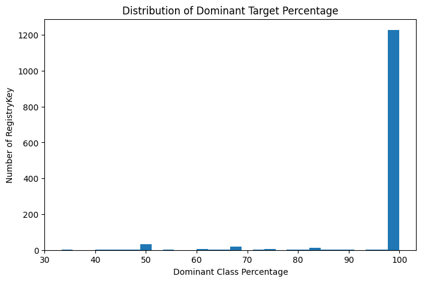

#### Purity Statistics
```python
print("100% Pure :", (result['max_target_pct'] == 100).sum())
print(">99% Pure :", (result['max_target_pct'] >= 99).sum())
print(">95% Pure :", (result['max_target_pct'] >= 95).sum())
print("<80% Pure :", (result['max_target_pct'] < 80).sum())
```
100% Pure : 1226
>99% Pure : 1227
>95% Pure : 1231
<80% Pure : 84

- The feature is overwhelmingly concentrated in the 100% Pure, >99% Pure, and >95% Pure categories, with ~1.2K observations each.
The <80% Pure category is rare, with only 84 observations, indicating a highly imbalanced distribution.

#### Entrory Distribution

```python
p = result[target_cols].div(result['total_count'], axis=0)
result['entropy'] = -(p * np.log2(p.replace(0, np.nan))).sum(axis=1)
result[['RegistryKey','entropy']].head()
plt.figure(figsize=(8,5))
plt.hist(result['entropy'], bins=30)
plt.xlabel("Entropy")
plt.ylabel("Number of RegistryKeys")
plt.title("Entropy Distribution Across RegistryKeys")
plt.show()
```

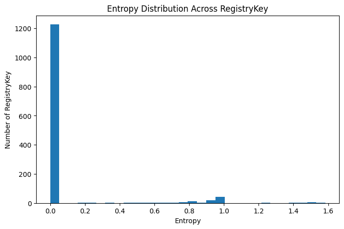

#### Target Distribtution for top 20 RegistryKeys
```python
top = result.nlargest(20,'total_count')

plot_df = top.set_index('RegistryKey')[
    ['FalsePositive_pct',
     'BenignPositive_pct',
     'TruePositive_pct']
]
plot_df.plot(
    kind='bar',
    stacked=True,
    figsize=(12,5)
)
plt.ylabel("Percentage")
plt.title("Target Distribution for Top 20 RegistryKeys")
plt.show()
```

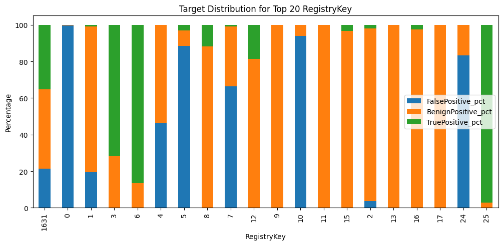

#### Dominant Class Count
```python
result['majority_class'].value_counts().plot.bar()
plt.ylabel("Number of RegistryKeys")
plt.title("Dominant IncidentGrade per RegistryKey")
plt.show()
```
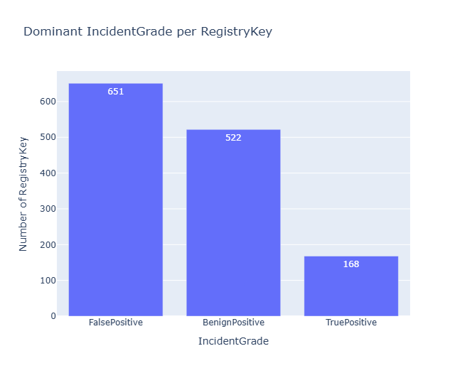

### Relationship with other numeric Cols
```python
corr_list = []

for chunk in chunk_dict.values():
    corr_list.append(chunk[numeric_cols].corr()['RegistryKey'])

RegistryKey_corr = pd.concat(corr_list, axis=1).mean(axis=1)
RegistryKey_corr = RegistryKey_corr.drop('RegistryKey').sort_values(key=abs, ascending=False)

print(RegistryKey_corr)
```
| RegistryValueData | 0.394382 |
| RegistryValueName | 0.378767 |
| AccountUpn | -0.030615 |
| AccountName | -0.023412 |
| IpAddress | -0.022473 |
| DetectorId | -0.015672 |
| IncidentId | 0.014883 |
| FileName | -0.014204 |
| FolderPath | -0.013232 |
| CountryCode | -0.012369 |
| Sha256 | -0.011912 |
| DeviceName | -0.011586 |
| Url | -0.011378 |
| State | -0.011292 |
| City | -0.011280 |
| DeviceId | -0.008127 |
| AlertTitle | 0.006884 |
| ApplicationName | -0.006499 |
| ApplicationId | -0.006407 |
| OSVersion | -0.006119 |
| OSFamily | -0.006115 |
| OrgId | -0.002926 |
| EmailClusterId | NaN |

- Observation: The features exhibit mixed linear correlations with the target feature, RegistryKey. RegistryValueData (0.394) shows the strongest positive correlation, followed by RegistryValueName (0.379). AccountUpn (-0.031) has the strongest negative correlation, followed by AccountName (-0.023) and IpAddress (-0.022). Most remaining features show very weak correlations close to zero. Since these features are largely categorical or high-cardinality identifiers, Pearson correlation should be interpreted as a descriptive measure only, rather than evidence of a meaningful relationship or causation.